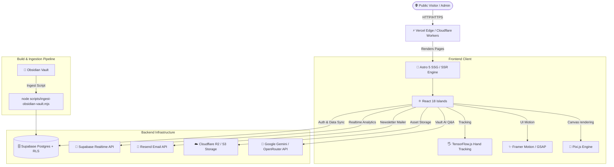

# 🌌 Personal Site & SaaS Engine

[](https://astro.build)
[](https://reactjs.org)
[](https://supabase.com)
[](https://tailwindcss.com)
[](https://www.tensorflow.org/js)
[](https://nodejs.org)
[](https://vercel.com)

> A full-stack creative web platform combining an **interactive digital ecosystem**, a **SaaS backend admin panel**, an **Obsidian PKM vault ingestion engine**, **computer vision gesture controls**, and live interactive project portals.

---

## ⚡ Quick Navigation

| Module | Route / Path | Highlights |
| :--- | :--- | :--- |
| 🎛️ **SaaS Admin Backend** | [`/admin/dashboard`](file:///Users/abodid/Documents/GitHub/personal-site/src/pages/admin/dashboard.astro) | Real-time analytics, Newsletter Studio, CMS content editor, Media library, SEO previewer |
| 💼 **Work Portfolio** | [`/work`](file:///Users/abodid/Documents/GitHub/personal-site/src/pages/work/index.astro) | Filterable project showcase, interactive card stacker, live case study views |
| 🧠 **Obsidian Digital Garden** | [`/obsidian-tutoring`](file:///Users/abodid/Documents/GitHub/personal-site/src/pages/obsidian-tutoring.astro) | Automated markdown vault sync, bi-directional constellation graph, Gemini AI vault assistant |
| 🖐️ **Gesture Control Lab** | [`/hand-tracking-test`](file:///Users/abodid/Documents/GitHub/personal-site/src/pages/hand-tracking-test.astro) | Real-time webcam hand tracking (TensorFlow.js + MediaPipe) for touchless UI navigation |
| 🎬 **Film & Media Studio** | [`/films`](file:///Users/abodid/Documents/GitHub/personal-site/src/pages/films.astro) | Video player matrix, brand film strip showcase, filter engine |
| 📸 **Photography & Moodboard** | [`/photography`](file:///Users/abodid/Documents/GitHub/personal-site/src/pages/photography/index.astro) | Polaroid scatter canvas, ColorThief palette extractor, interactive Punctum gallery game |
| 🏛️ **Live Event Portals** | [`/bsa-schedule`](file:///Users/abodid/Documents/GitHub/personal-site/src/pages/bsa-schedule.astro) | BSA Conference schedule & networking app, Odisha 1900 archive, UK 2026 gallery |

---

## 🎛️ SaaS Backend Admin Panel Overview

The authenticated admin panel (`/admin/dashboard`) provides a complete SaaS management workspace powered by Supabase Auth, Row-Level Security (RLS), and Supabase Realtime updates.

### 🖥️ Admin Dashboard Wireframe Preview

```
+-----------------------------------------------------------------------------------------------+
|  NAV: [📊 Analytics]  [📧 Newsletter Studio]  [📝 Content CMS]  [📁 Media]  [🔍 SEO]  [👥 Users] |
+-----------------------------------------------------------------------------------------------+
|  REAL-TIME METRICS & STATUS                                           🟢 Live Updates: ON    |
|  +-----------------------+ +-----------------------+ +-----------------------+ +-------------+ |
|  | Active Human Sessions | | Avg Engagement Time   | | Total Page Views      | | Top Country | |
|  |        1,482          | |        4m 12s         | |        14,890         | |  🇬🇧 UK (42%)| |
|  +-----------------------+ +-----------------------+ +-----------------------+ +-------------+ |
+-----------------------------------------------------------------------------------------------+
|  PANEL CONTENT AREA (Tab Selected: Analytics / Newsletter / CMS / Media / SEO)                |
|                                                                                               |
|  📈 Chart.js Traffic Timeline        🗺️ Geographic Traffic Map        📧 React-Email Editor   |
|  [----------------------------]      [=======================]        [---------------------] |
|  [                            ]      [                       ]        [ Visual Drag & Drop  ] |
|  [----------------------------]      [=======================]        [---------------------] |
+-----------------------------------------------------------------------------------------------+
|  📌 Curator Sticky Board & Workspace Notepad                                                  |
|  - [x] Send monthly product digest via Newsletter Studio                                       |
|  - [ ] Update photography metadata for UK 2026 gallery                                         |
+-----------------------------------------------------------------------------------------------+
```

---

### 📊 1. Real-time Privacy-First Analytics Dashboard
*Location:* [`src/components/admin/AnalyticsDashboard.jsx`](file:///Users/abodid/Documents/GitHub/personal-site/src/components/admin/AnalyticsDashboard.jsx) | *Docs:* [`docs/admin-analytics.md`](file:///Users/abodid/Documents/GitHub/personal-site/docs/admin-analytics.md)

* **Human vs. Filtered Traffic Segmentation**: Automatically isolates genuine human engagement (sessions with $\ge 2$ seconds of active visibility) from bots, crawlers, and rapid bounces.
* **Visitor Journey Tracking**: Logs anonymous page navigation sequences, time-on-page, active scrolling, and mobile menu interaction funnels without storing IP addresses.
* **Live Telemetry & Visualizations**: Real-time line charts, country acquisition bar charts, and referral pie charts built with **Chart.js** and **Supabase Realtime**.

---

### 📧 2. Newsletter Studio & Drag-and-Drop Sender
*Location:* [`src/components/admin/NewsletterSender.jsx`](file:///Users/abodid/Documents/GitHub/personal-site/src/components/admin/NewsletterSender.jsx) & [`NewsletterBlockEditor.jsx`](file:///Users/abodid/Documents/GitHub/personal-site/src/components/admin/NewsletterBlockEditor.jsx)

* **Block-Based Drag-and-Drop Editor**: Modular email composer powered by `@dnd-kit/core` and `@react-email/components`.
* **Media Integration**: Directly select photos from the internal media library via [`NewsletterMediaPicker.jsx`](file:///Users/abodid/Documents/GitHub/personal-site/src/components/admin/NewsletterMediaPicker.jsx).
* **Batch Dispatching Engine**: Server-side transactional and campaign email broadcasting using the **Resend API**.

---

### 📝 3. CMS & Content Management Suite
*Location:* [`src/components/admin/ContentEditor.jsx`](file:///Users/abodid/Documents/GitHub/personal-site/src/components/admin/ContentEditor.jsx) & [`PhotoStoryManager.jsx`](file:///Users/abodid/Documents/GitHub/personal-site/src/components/admin/PhotoStoryManager.jsx)

* **Work Portfolio CMS**: Add, edit, reorder, and tag portfolio projects, case studies, and brand client strips.
* **Photo Story Manager**: Curate photography stories with captioning, tag clustering, and EXIF metadata views.
* **Quote & Brand Managers**: Dynamic CRUD operations for Paul Graham quotes, brand films, and client showcases.

---

### 🔍 4. SEO Studio & OpenGraph Engine
*Location:* [`src/components/admin/SeoStudio.jsx`](file:///Users/abodid/Documents/GitHub/personal-site/src/components/admin/SeoStudio.jsx) & [`og-preview.astro`](file:///Users/abodid/Documents/GitHub/personal-site/src/pages/admin/og-preview.astro)

* **Dynamic OpenGraph Previewer**: Generates and previews social sharing cards in real time using `@vercel/og`.
* **SERP Visualizer**: Simulates Google search result presentation for any page route on desktop and mobile.
* **Automated Audit**: Checks meta title lengths, description densities, missing alt tags, and JSON-LD schema validity.

---

### 📁 5. Media Library & Asset Manager
*Location:* [`src/components/admin/MediaLibrary.jsx`](file:///Users/abodid/Documents/GitHub/personal-site/src/components/admin/MediaLibrary.jsx)

* **Multi-Cloud Storage**: Seamlessly uploads to Supabase S3 buckets or Cloudflare R2 object storage using AWS SDK S3 clients.
* **Auto-WebP Converter**: Automated client/server image optimization scripts for high-density visual media.

---

### 🔐 6. Role-Based Access Control (RBAC) & Security
*Location:* [`src/components/admin/UserList.jsx`](file:///Users/abodid/Documents/GitHub/personal-site/src/components/admin/UserList.jsx) & [`scripts/promote-to-admin.js`](file:///Users/abodid/Documents/GitHub/personal-site/scripts/promote-to-admin.js)

* **Granular User Roles**: Role management supporting `admin`, `curator`, and default `user` permission levels.
* **Row-Level Security (RLS)**: Database tables are locked with Supabase RLS policies ensuring non-admin requests receive `403 Admin access required`.

---

## 💼 Portfolio & Creative Media Hub

### 📁 Interactive Work Portfolio (`/work`)
* Filterable portfolio grid (`PortfolioFilter.jsx`) with dynamic card stack animations (`FlowCardStack.jsx`, `CardStacker.jsx`).
* Deep case studies with project metadata, interactive tags, and client metrics.

### 🎬 Film & Motion Showcase (`/films`)
* Filterable video gallery with custom playback controls and brand film strips (`BrandFilmStrip.jsx`).

### 📸 Photography & Moodboard Engine (`/photography`, `/moodboard`)
* **Polaroid Scatter**: Physics-assisted drag-and-drop polaroid image layout (`PolaroidScatter.jsx`).
* **Color Palette Extraction**: Dynamic dominant color palette extraction from photos using `colorthief`.
* **Punctum Gallery Game**: Interactive visual trivia and photography perception game (`PunctumGame.jsx`).

### 🏛️ Live Event Portals & Archives
* **BSA Conference Schedule & Networking App** ([`/bsa-schedule`](file:///Users/abodid/Documents/GitHub/personal-site/src/pages/bsa-schedule.astro), [`/bsa-networking`](file:///Users/abodid/Documents/GitHub/personal-site/src/pages/bsa-networking.astro)): Offline-first conference agenda and delegate networking tool.
* **Odisha 1900 Archive** ([`/odisha1900`](file:///Users/abodid/Documents/GitHub/personal-site/src/pages/odisha1900.astro)): Interactive digital archive of historical documents and maps.
* **UK 2026 Media Hub** ([`/uk2026`](file:///Users/abodid/Documents/GitHub/personal-site/src/pages/uk2026.astro)): Immersive visual documentary showcase.

---

## 🧠 Obsidian Vault & Digital Garden Integration

The platform features a bi-directional Obsidian note sync engine:

```
┌─────────────────────────────────┐
│     Local Obsidian Vault        │
│  (.md notes + [[WikiLinks]])    │
└────────────────┬────────────────┘
                 │
                 ▼  scripts/ingest-obsidian-vault.mjs
┌─────────────────────────────────┐
│  AST & Frontmatter Parser       │
│  Extracts links, tags, metadata │
└────────────────┬────────────────┘
                 │
                 ▼
┌─────────────────────────────────┐       ┌─────────────────────────────────┐
│     Supabase / Storage API      │ ────> │  Constellation Graph View       │
│                                 │       │  (ConstellationGraph.jsx)       │
└────────────────┬────────────────┘       └─────────────────────────────────┘
                 │
                 ▼
┌─────────────────────────────────┐
│   AI Vault Assistant (Gemini)   │
│   Semantic search & Q&A chatbot │
└─────────────────────────────────┘
```

* **Ingest Script**: [`scripts/ingest-obsidian-vault.mjs`](file:///Users/abodid/Documents/GitHub/personal-site/scripts/ingest-obsidian-vault.mjs) parses raw Obsidian markdown notes into structured database entities.
* **Constellation Graph**: Interactive 2D canvas visualization ([`ConstellationGraph.jsx`](file:///Users/abodid/Documents/GitHub/personal-site/src/components/ConstellationGraph.jsx)) mapping note relationships.
* **AI Vault Assistant**: Conversational Q&A over the note repository powered by Google Gemini 2.5 Flash and OpenRouter embeddings ([`VaultAskSection.astro`](file:///Users/abodid/Documents/GitHub/personal-site/src/components/VaultAskSection.astro)).
* **Obsidian Tutoring Hub**: Dedicated service landing page for PKM coaching ([`/obsidian-tutoring`](file:///Users/abodid/Documents/GitHub/personal-site/src/pages/obsidian-tutoring.astro)).

---

## 🖐️ Hand Tracking & Gesture Control Sandbox

An experimental browser-based touchless gesture navigation system:

* **Location**: [`src/pages/hand-tracking-test.astro`](file:///Users/abodid/Documents/GitHub/personal-site/src/pages/hand-tracking-test.astro) & [`src/components/hand-tracking-test/`](file:///Users/abodid/Documents/GitHub/personal-site/src/components/hand-tracking-test)
* **ML Stack**: TensorFlow.js (`@tensorflow-models/hand-pose-detection`) and MediaPipe (`@mediapipe/hands`).
* **Supported Gestures**:
  * 👌 **Pinch**: Drag and resize elements on the interactive canvas.
  * 👆 **Point**: Move custom liquid/pixel cursor followers ([`LiquidCursor.jsx`](file:///Users/abodid/Documents/GitHub/personal-site/src/components/LiquidCursor.jsx)).
  * ✋ **Open Palm**: Pause playback or trigger full-screen mode.
  * 👈👉 **Swipe**: Navigate between portfolio slides and moodboard items.

---

## 🏗️ System Architecture & Data Flow



---

## 📂 Repository Directory Tree

```
personal-site/
├── docs/                           # Architectural guides & setups
│   ├── admin-analytics.md          # Database schema & setup for analytics
│   ├── unified-work-portfolio.md   # Unified work portfolio specifications
│   └── MULTI_TOOL_GIT_WORKFLOW.md  # Git workflow guidelines
├── public/                         # Static public assets
│   ├── images/                     # Admin & site images
│   └── scripts/
│       └── journey-tracker.js      # Privacy-first frontend session tracker
├── scripts/                        # Ingestion, PDF generation & migration scripts
│   ├── ingest-obsidian-vault.mjs   # Obsidian markdown vault sync engine
│   ├── promote-to-admin.js         # User role promotion tool
│   └── generate-photography-portfolios.mjs
├── sql/                            # PostgreSQL migrations & seeds
│   └── bsa-schedule/              # BSA conference database schema
├── src/
│   ├── components/                 # Reusable UI components & React Islands
│   │   ├── admin/                  # SaaS Admin Panel UI components
│   │   │   ├── AdminDashboard.jsx  # Main admin orchestrator
│   │   │   ├── AnalyticsDashboard.jsx # Privacy-first analytics panel
│   │   │   ├── ContentEditor.jsx   # CMS editor for projects & work
│   │   │   ├── MediaLibrary.jsx    # S3/R2 asset manager
│   │   │   ├── NewsletterBlockEditor.jsx # Drag-and-drop email builder
│   │   │   ├── NewsletterSender.jsx# Email broadcasting engine
│   │   │   ├── SeoStudio.jsx       # OpenGraph & SERP preview studio
│   │   │   └── UserList.jsx        # User directory & RBAC
│   │   ├── hand-tracking-test/     # TensorFlow hand tracking components
│   │   ├── ConstellationGraph.jsx  # Obsidian bi-directional graph viewer
│   │   ├── LandingOrchestrator.jsx # Dynamic hero canvas controller
│   │   ├── PolaroidScatter.jsx     # Interactive photography layout
│   │   └── PunctumGame.jsx         # Photography perception game
│   └── pages/                      # Astro file-based routes
│       ├── admin/                  # Authenticated admin routes
│       ├── api/                    # Serverless API routes
│       ├── work/                   # Work portfolio pages
│       ├── bsa-schedule.astro      # Live BSA Conference schedule
│       ├── hand-tracking-test.astro# Gesture control demo page
│       ├── obsidian-tutoring.astro # Obsidian mentorship landing page
│       ├── photography.astro       # Photography gallery
│       ├── index.astro             # Main landing page
│       └── login.astro             # Auth login page
├── supabase/                       # Supabase CLI migrations & schema
│   └── migrations/                 # PostgreSQL schema migrations
├── astro.config.mjs                # Astro configuration file
├── package.json                    # Dependencies & NPM scripts
└── playwright.config.ts            # E2E test configuration
```

---

## ⚡ Quick Start & Development Setup

### 1. Prerequisites
* **Node.js**: `v24.x` (enforced via `.nvmrc` and `package.json`)
* **Package Manager**: `npm`

### 2. Environment Setup
Copy the example environment configuration:
```bash
cp .env.example .env
```
Fill in your keys in `.env`:
```env
PUBLIC_SUPABASE_URL=https://your-project-id.supabase.co
PUBLIC_SUPABASE_ANON_KEY=your-anon-key
SUPABASE_SERVICE_ROLE_KEY=your-service-role-key
RESEND_API_KEY=re_your-resend-key
GOOGLE_API_KEY=your-gemini-key
```

### 3. Installation & Database Setup
```bash
# Install dependencies
npm install

# Link Supabase project & push database migrations
supabase link --project-ref your-project-ref
supabase db push

# Promote an account to Admin
node scripts/promote-to-admin.js admin@example.com
```

### 4. Run Development Server
```bash
npm run dev
```
Open [http://localhost:4321](http://localhost:4321) in your browser.

---

## 🧪 Testing & Quality Assurance

```bash
# Run Analytics unit tests
npm run test:analytics

# Run Work Portfolio unit tests
npm run test:portfolio

# Run Newsletter unit tests
npm run test:newsletter

# Run Playwright End-to-End tests
npm run test:e2e:portfolio
```

---

## 📜 License

Created with ❤️ by **Abodid Sahoo**. Built using Astro, React, Supabase, and TensorFlow.js.
