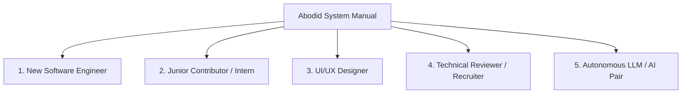

# 00.00 — Manual Charter and Audiences

Status: Current  
Last Updated: 2026-09-18  

---

## 1. Purpose of the Manual

The Abodid System Manual is the canonical technical, creative, and operational specification for the `abodid.com` digital ecosystem. 

It is designed to eliminate tribal knowledge, establish an immutable architectural baseline, and provide the comprehensive foundation required to operate, extend, or completely rebuild the entire ecosystem over a 10–15 year horizon.

This manual is not a temporary report or an ephemeral export. The Markdown files within `docs/system-manual/abodid-system-manual/` constitute the permanent source of truth from which web documentation, recruiter case studies, designer briefs, and LLM context packages are derived.

---

## 2. Intended Audiences

The manual is structured to support five distinct reader profiles:

### 2.1. The New Software Engineer
- **Goal**: Understand the codebase end-to-end, configure the local workspace, execute migrations, and deploy new features without breaking existing subsystems.
- **Key Chapters**: [02 — Information Architecture](../02-information-architecture/02.00-route-hierarchy-and-subdomains.md), [05 — Application and Code Architecture](../05-application-code-architecture/05.00-astro-core-and-rendering-strategy.md), [06 — Data, Media, and Knowledge](../06-data-media-knowledge/06.00-supabase-database-architecture.md), [09 — Infrastructure and Security](../09-infrastructure-security-ops/09.00-infrastructure-topology-and-dns.md), [10 — Onboarding Runbook](../10-evolution-alternatives-onboarding/10.00-zero-to-one-setup-guide.md).

### 2.2. The Junior Contributor or Intern
- **Goal**: Understand how individual modules (such as the Curation Layer, Reading Digest, or Obsidian sync) operate without needing to reverse-engineer thousands of lines of TypeScript.
- **Key Chapters**: [02.04 — Content Workflows](../02-information-architecture/02.04-content-authoring-workflows.md), [04 — Projects and Research](../04-projects-research/04.00-project-taxonomy-and-structure.md), [08 — AI and Automation](../08-ai-automation/08.00-ai-architecture-and-model-routing.md).

### 2.3. The UI/UX and Brand Designer
- **Goal**: Internalize the "Abodid Pop Editorial" design system, typographic hierarchy, responsive grid behaviors, and interactive color mechanics.
- **Key Chapters**: [01 — Philosophy and Manifesto](../01-philosophy-manifesto/01.00-core-manifesto-and-positioning.md), [03 — Visual System and Moodboards](../03-visual-system/03.00-abodid-pop-editorial-design-system.md).

### 2.4. The Technical Reviewer, Evaluator, or Recruiter
- **Goal**: Evaluate the architectural depth, technical sophistication, systems design discipline, and artistic rigor of Abodid's creative technology ecosystem.
- **Key Chapters**: [01.00 — Positioning](../01-philosophy-manifesto/01.00-core-manifesto-and-positioning.md), [04.01 — Punctum Suite](../04-projects-research/04.01-the-punctum-suite.md), [05.05 — Architectural Revamps](../05-application-code-architecture/05.05-architectural-evolution-and-refactors.md), [08.03 — AI Postmortems](../08-ai-automation/08.03-ai-failure-modes-and-human-corrections.md).

### 2.5. The LLM and Autonomous Coding Agent
- **Goal**: Ingest accurate, unambiguous context regarding schemas, routing rules, API signatures, and design tokens to generate conformant code without hallucination.
- **Key Chapters**: All chapters, indexed via [INDEX.md](../INDEX.md) and defined in [GLOSSARY.md](../GLOSSARY.md).

---

## 3. Ten-to-Fifteen Year Continuity Perspective

Web platforms frequently suffer from link rot, framework churn, and vendor deprecation. This manual is authored under the following continuity principles:

1. **Format Durability**: Pure Markdown syntax with standard CommonMark specifications. No proprietary extensions or closed CMS dependencies.
2. **Schema Permanence**: Database schemas and migration histories are fully documented as plain SQL and typed interfaces.
3. **Decoupled Architecture**: Frontends (Astro), databases (Postgres), storage (S3/R2), and compute (Serverless/Edge) are treated as modular primitives with documented migration paths.
