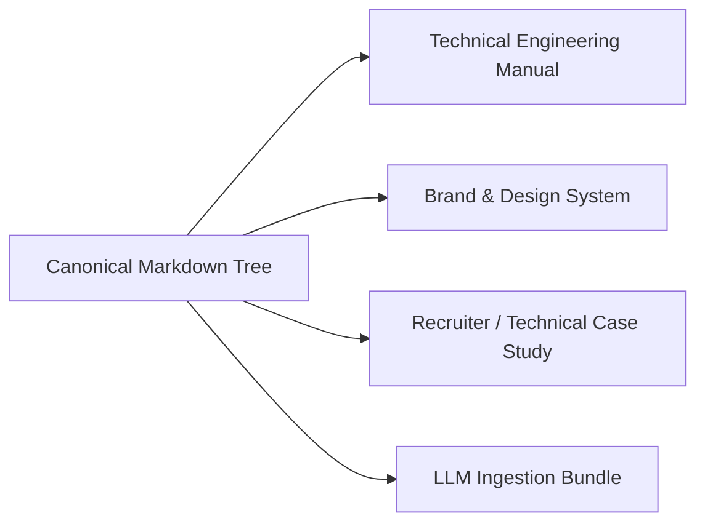

# 00.03 — Modular Generation and Maintenance Guide

Status: Current  
Last Updated: 2026-09-18  

---

## 1. Modularity Invariant

Every Markdown document within the system manual is authored as an **independently readable, modular unit**. 

- Concepts are not duplicated across multiple documents.
- Cross-references use relative Markdown links with descriptive anchors (e.g., `See [06.00 Supabase Schema](../06-data-media-knowledge/06.00-supabase-database-architecture.md)`).
- Updating a single section does not break the integrity of adjacent files.

---

## 2. Generating Targeted Partial Manuals

Because the manual is organized by discrete concerns, specific sub-manuals can be extracted or compiled on demand without manual restructuring:

### 2.1. Technical Engineering Manual
- **Included Files**: Chapters `00`, `02`, `05`, `06`, `08`, `09`, `10`.
- **Target Audience**: Backend engineers, full-stack developers, infrastructure specialists.
- **Compilation Strategy**: Concatenate in numerical order; renders a complete system rebuild manual.

### 2.2. Design System and Visual Manual
- **Included Files**: Chapters `00`, `01`, `03`, `04.01` (Punctum), `04.02` (Lab).
- **Target Audience**: UI/UX designers, creative technologists, art directors.
- **Compilation Strategy**: Focuses on "Abodid Pop Editorial" tokens, type scales, and interaction mechanics.

### 2.3. Recruiter and Executive Case Study
- **Included Files**: `00.00`, `01.00`, `01.01`, `04.00`, `04.01`, `05.05`, `08.03`.
- **Target Audience**: Technical recruiters, evaluators, exhibition curators, academic reviewers.
- **Compilation Strategy**: Highlights creative vision, systems engineering rigor, and real-world failure postmortems.

### 2.4. LLM Knowledge Context Package
- **Included Files**: Entire directory `docs/system-manual/abodid-system-manual/`.
- **Ingestion**: Can be bundled as a single context window or indexed into a vector database for semantic retrieval by coding assistants.

---

## 3. Maintenance Conventions

When editing or extending the manual:
1. **Writing Style**: Direct, factual, concise. Omit filler phrases, marketing fluff, and boilerplate introductory paragraphs.
2. **Path References**: Always use repository-relative file links (e.g., `[src/middleware.ts](file:///Users/abodid/Documents/GitHub/personal-site/src/middleware.ts)`).
3. **Code Symbols**: Always link classes, functions, and interfaces clearly.
4. **Link Integrity**: Before committing, verify that all relative Markdown links resolve to existing files.
