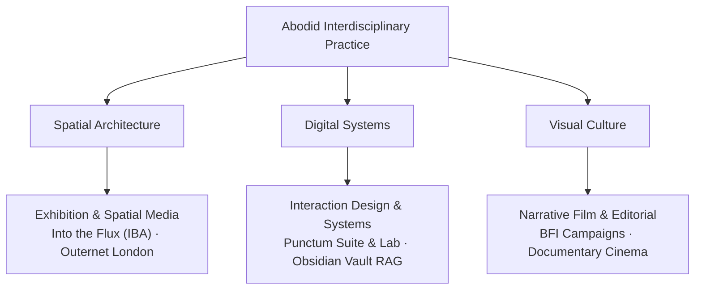

# 01.00 — Core Manifesto and Professional Positioning

Status: Current  
Last Updated: 2026-09-18  

---

## 1. Mission and Positioning Statement

`abodid.com` is the central operating platform, research archive, and public portfolio of **Abodid Sahoo** (operating as **Abodid and Co**). 

The practice operates at the intersection of:
1. **Spatial & Exhibition Architecture**: Immersive physical environments, cultural venue transformations, and experiential flow design.
2. **Digital Systems & Interaction Design**: High-performance web applications, research prototypes, and personal knowledge graphs (Obsidian).
3. **Visual Culture & Narrative Direction**: Editorial photography, documentary filmmaking, and institutional cultural campaigns.

---

## 2. The Core Manifesto

1. **Research is Validated Through Making**: Theory that does not materialize as a working interface, physical exhibition, photograph, or film remains incomplete.
2. **Friction Over Bland Homogenization**: Reject the sterile, interchangeable templates of modern software. Interfaces should possess texture, editorial weight, and tactile personality.
3. **Depth Over Ephemerality**: Build tools, knowledge archives, and digital media intended to survive multi-decade technological churn.
4. **Human Authorship in the Machine Age**: Artificial intelligence is an execution accelerator, never the author of intent or arbiter of taste.

---

## 3. Professional Background and Milestones

Abodid Sahoo's interdisciplinary practice bridges major institutional commissions and independent research initiatives:

- **Royal College of Art (RCA), London**: Digital Direction, Spatial Media & Visual Culture.
- **Cultural Institutions & Clients**: British Film Institute (BFI), Outernet London, International Body of Art (IBA), Wieden+Kennedy, Uniqlo, Budweiser, Hermosa Design Studio.
- **Flagship Exhibitions**:
  - *Into the Flux (IBA)*: Transformed an abandoned London garage into a high-throughput cultural exhibition (10,000+ visitors in 48 hours).
  - *Outernet London*: Spatial media installations reaching global audiences.
  - *BFI London Film Festival Expanded*: Lead visual documentation and campaign direction across 4 festival days.
- **Independent Research**: Author of the *Invisible Punctum* research framework, developer of custom gesture-tracking interaction interfaces, and creator of the open-access Obsidian digital garden.
