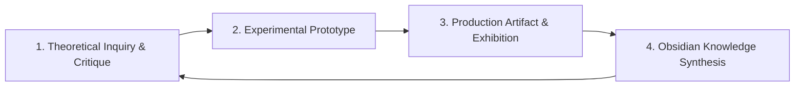

# 01.01 — Creative and Research Practice

Status: Current  
Last Updated: 2026-09-18  

---

## 1. The Research-Through-Making Methodology

The studio rejects the separation between academic research and commercial/artistic production. Theory directly informs digital interface experiments, while practical engineering constraints refine conceptual inquiries.

---

## 2. Practice Pillars

### 2.1. Documentary Filmmaking and Cinematography
- **Approach**: Observational realism blended with structured editorial rhythm.
- **Production Standards**: High dynamic range color workflows, custom sound design, narrative pacing that emphasizes authentic human emotion over artificial corporate polish.
- **Domains**: Cultural documentaries, brand narrative films, artist profiles.

### 2.2. Fine Art and Editorial Photography
- **Philosophy**: Composition grounded in street photography, architectural form, and involuntary emotional punctum.
- **Series Taxonomy**: Categorized strictly into verified series (`exhibitions`, `documentary`, `editorial`, `fine-art`, `commercial`).
- **Media Invariant**: Photographs are served uncropped in their native aspect ratios to preserve compositional integrity.

### 2.3. Creative Technology and Spatial Interfaces
- **Interactive Prototyping**: Building real-time computer vision interfaces (MediaPipe, TensorFlow.js) that eliminate traditional mouse/touch boundaries (e.g., zero-touch gesture image flicking).
- **Physical-Digital Convergence**: Designing synchronized audiovisual environments, responsive lighting systems, and projection-mapped spatial exhibitions.

### 2.4. Knowledge Graph Architecture (Obsidian)
- **Second Brain Engineering**: Operating an interconnected Obsidian vault (>300 public notes) as an open research garden.
- **Semantic Linkage**: Utilizing bidirectional links, atomic note structures, and vector embeddings to bridge diverse disciplines (cinematography, systems architecture, cognitive psychology).
