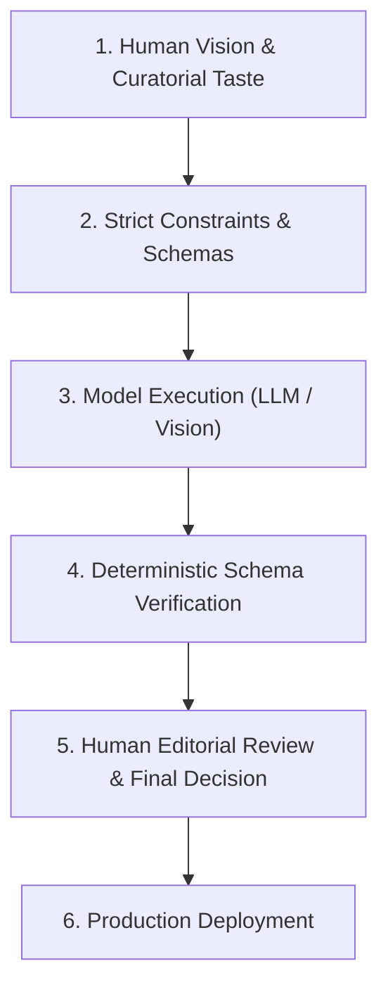

# 01.02 — Human-Directed AI Principles

Status: Current  
Last Updated: 2026-09-18  

---

## 1. Core AI Philosophy: Directed Execution vs Unrestricted Agency

In the Abodid ecosystem, Artificial Intelligence (LLMs, vision models, embedding pipelines) is treated strictly as an **accelerator and cognitive synthesizer**, never as an autonomous creator with unguided agency.

---

## 2. Invariant Principles of AI Interaction

### 2.1. Rejection of Synthetic Genericness
- AI models naturally drift toward bland, middle-of-the-road phrasing and cliché visual styles.
- **Rule**: Every AI generation prompt must include negative constraints, specific tone guidelines, and structured schemas that forbid boilerplate text, buzzwords, and marketing clichés.

### 2.2. Deterministic Validation over Probabilistic Trust
- Never trust raw LLM text outputs directly in database writes or UI rendering.
- **Rule**: All AI responses must be forced into structured JSON formats (via tools or JSON mode) and parsed through strict Zod schemas before being accepted.

### 2.3. Transparent Provenance
- When AI assists in classification, synthesis, or extraction (e.g., in the Daily Reading Digest or Opportunity Radar), the system records the exact model name, prompt timestamp, and confidence scores.

### 2.4. Human Judgment as the Ultimate Arbiter
- Autonomous routines (like cron discovery) may gather and rank candidates, but publishing, curating, and establishing site structure remain under direct human control.
