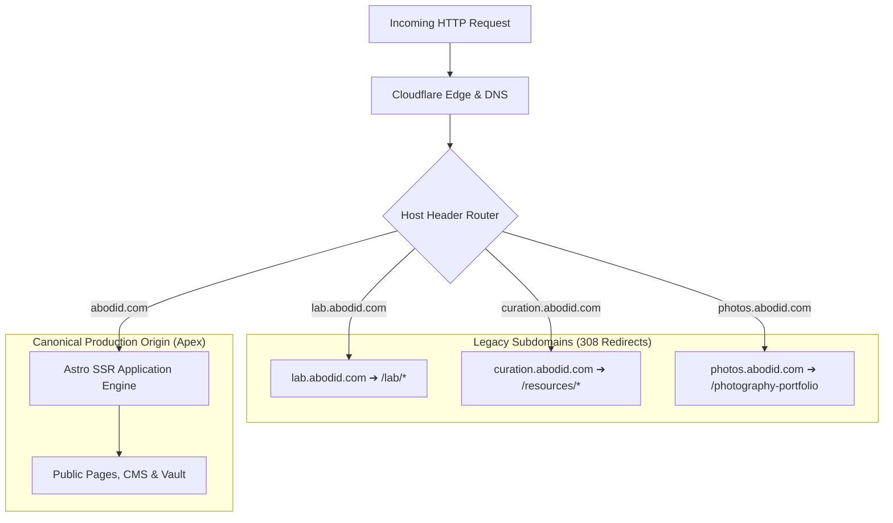

# 02.00 — Route Hierarchy and Subdomain Architecture

Status: Current  
Last Updated: 2026-09-18  

---

## 1. Domain and Subdomain Map

The ecosystem is anchored by the primary apex domain `abodid.com`, with legacy and specialized subdomains routed through Vercel and Astro middleware:

### 1.1. Host Routing Matrix

| Hostname | Role / Behavior | Target Destination |
| :--- | :--- | :--- |
| `abodid.com` | **Canonical Apex Origin**. Hosts all public pages, unified portfolio, lab, vault, and admin workspaces. | Direct resolution. |
| `www.abodid.com` | Vercel automatic alias. | Permanent 308 redirect to `https://abodid.com/*`. |
| `lab.abodid.com` | Legacy Lab subdomain. | 308 redirect to `https://abodid.com/lab/*` (or root `/lab`). |
| `curation.abodid.com` | Legacy Curation subdomain. | 308 redirect to `https://abodid.com/resources/*`. |
| `photos.abodid.com` | Legacy Photography subdomain. | 308 redirect to `https://abodid.com/photography-portfolio`. |

---

## 2. Master Route Inventory

### 2.1. Public Content and Storytelling Routes
- `/` — Flagship landing page, hero positioning, pillars, selected works, and audio captions.
- `/work` — Unified Work portfolio directory (filterable by category, tags, and client).
- `/work/[slug]` — Individual published case study snapshot rendered via `portfolio_blocks`.
- `/photography` — Interactive photography directory and collection viewer.
- `/photography/[...slug]` — Series-level photography collection viewer.
- `/photography-portfolio` — Clean editorial photo index with Athul Prasad-inspired staggered grid and lightbox.
- `/films` & `/films/[slug]` — Cinematography showcase and embedded film players.
- `/lab` — Interactive creative technology experiment directory.
- `/lab/punctum` — Invisible Punctum visual theory study, coordinate analysis, and AI worlds.
- `/lab/image-flick` — Zero-touch gesture-controlled image stack (MediaPipe / TensorFlow.js).
- `/lab/sequence-room` — Spatial Polaroid image sequencing workspace.
- `/lab/glyph-loom` — Interactive parametric typography engine.
- `/obsidian-vault` — Public digital garden root directory.
- `/obsidian-vault/[...slug]` — Public rendered Obsidian note with backlinks and graph context.
- `/obsidian-vault/topic/[topic]` — Tagged note directory.
- `/blog` & `/blog/[...slug]` — Editorial essays, retrospective articles, and long-form memoirs.
- `/manifesto`, `/about`, `/cv` — Core philosophical statements, studio background, and verified CV.
- `/services`, `/contact`, `/newsletter` — Engagement inquiries, client offerings, and newsletter subscription.

### 2.2. Interactive Tooling and Community Routes
- `/resources` — Creative technologist tools, curated libraries, and bookmarking.
- `/resources/[id]` — Detailed resource profile.
- `/resources/submit` — Curator submission portal.
- `/opportunities` — Curated grants, residencies, and creative funding tracker.
- `/moodboard`, `/boudoir-moodboard` — Interactive color palette moodboard viewers.
- `/one-photo` — Participatory photo submission and visual experiment.

### 2.3. Protected and Administrative Routes
- `/admin/dashboard` — Unified Site Workspace (portfolio editor, analytics, network intelligence, SEO studio).
- `/admin/projects/new` & `/admin/projects/[slug]` — Desktop portfolio project draft editor.
- `/admin/network` — Private LinkedIn Network Intelligence graph and semantic search.
- `/admin/seo` — Social share image previewer and OpenGraph card generator.
- `/admin/login` — Supabase authentication entry point.
