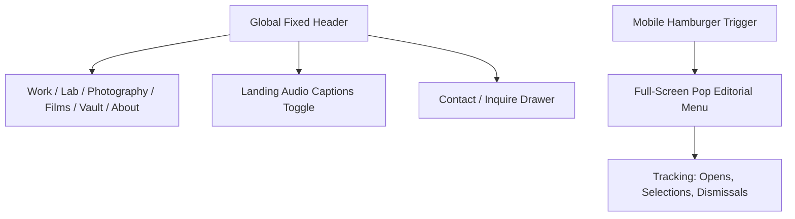

# 02.01 — Navigation System and Visitor Journeys

Status: Current  
Last Updated: 2026-09-18  

---

## 1. Navigation Architecture

The site navigation is designed for fluid editorial exploration across desktop and mobile form factors:

### 1.1. Header Components
- **Wordmark**: `Abodid and Co` (links to `/`).
- **Pillar Links**: Work, Lab, Photography, Vault, Writing, About.
- **Red Reading Progress Bar**: Real-time scroll indicator on long-form essays and case studies.
- **Micro-Interactions**: Hover underlines with snappy cubic-bezier transitions.

### 1.2. Pop Editorial Mobile Menu Drawer
- Full-viewport modal overlay styled in monochrome typography with high-contrast active state indicators.
- Keyboard-accessible: Escape key triggers dismissal; auto-focuses first menu item on open.
- Integrated analytics listeners dispatch navigation telemetry to `/api/analytics/collect`.

---

## 2. Visitor Journey Tracking Pipeline

The ecosystem employs a custom, privacy-preserving journey tracking client (`public/scripts/journey-tracker.js`):

1. **Session Generation**: A cryptographic session ID is initialized in `sessionStorage`.
2. **Engagement Threshold**: To eliminate bot traffic and bounce noise, a visit is only classified as **Human** after **2 seconds** of active, focused visibility (`document.visibilityState === 'visible'`).
3. **Event Tracking**:
   - Page view transitions.
   - Active dwell time (heartbeats every 10s during active focus).
   - Navigation menu selections and dismissals.
   - Outbound CTA clicks (e.g., inquiry forms, external project links).
4. **Data Transmission**: Dispatched via `navigator.sendBeacon` or non-blocking `fetch` to `POST /api/analytics/collect`.
