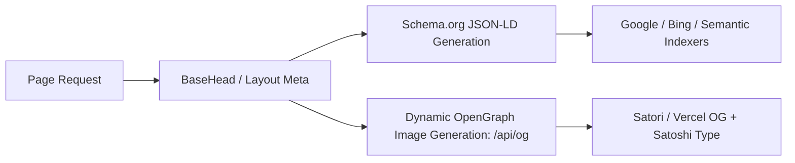

# 02.03 — SEO, Structured Data, and Machine Discovery

Status: Current  
Last Updated: 2026-09-18  

---

## 1. Structured Data and OpenGraph Architecture

The ecosystem implements programmatic SEO to ensure high-fidelity social sharing and accurate machine ingestion.

### 1.1. Dynamic OpenGraph Generation (`/api/og`)
- **Engine**: `@vercel/og` (Satori-based SVG-to-PNG renderer).
- **Design System**: Renders the **Abodid Pop Editorial** card layout with Satoshi typography, bold accent badges, reading time, and content category.
- **Parameters**: `title`, `description`, `category`, `readingTime`, `theme` (dark/light).

### 1.2. Schema.org JSON-LD Types
- **Personal / Studio Entity**: `Person` and `Organization` metadata anchored to Abodid Sahoo with links to verified institutional affiliations (RCA, BFI).
- **Work Case Studies**: `CreativeWork` with author, datePublished, thumbnail, and contributor metadata.
- **Blog Essays & Vault Notes**: `Article` / `BlogPosting` with headline, description, author, wordCount, and citation references.
- **Photography Series**: `VisualArtwork` / `ImageGallery` with copyright and camera metadata.

---

## 2. Machine Discovery Files

### 2.1. Dynamic Sitemaps
The sitemap is partitioned into modular feeds generated dynamically during build:
- `/sitemap.xml`: Primary index linking sub-sitemaps.
- `/work-sitemap.xml`: Published Work case studies from Supabase.
- `/content-sitemap.xml`: Blog essays, films, static portfolio pages.
- `/vault-sitemap.xml`: 340+ public Obsidian notes.

### 2.2. Machine-Readable LLM Index (`/llms.txt`)
Provides a structured Markdown digest for autonomous AI scrapers and indexing bots, defining:
- Site owner identity, research pillars, and licensing.
- Curated index of key research papers, essays, and open-source Lab tools.

### 2.3. Robots Policy (`/robots.txt`)
- Allows public indexing of standard content routes.
- Disallows crawling of private/admin endpoints (`/admin/`, `/api/admin/`, `/api/tracking/`, `/opportunities/`).
