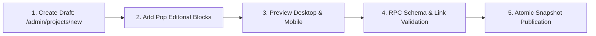

# 02.04 — Content Authoring and Publishing Workflows

Status: Current  
Last Updated: 2026-09-18  

---

## 1. Work Case Study Workflow

Work projects are managed via the Unified Portfolio CMS at `/admin/dashboard?section=portfolio_projects`:



1. **Initiate**: Click **New Project** in Admin Panel. Generates initial UUID and slug.
2. **Assemble Content**: Add semantic blocks (Text, Full-Width Image, Split Media, Interactive Embed, Quote Callout).
3. **Configure Meta**: Assign primary pillar (Spatial, Systems, Culture), client/context, collaborators, and cover image.
4. **Publish**: Click **Publish Project**. Triggers atomic Postgres RPC cloning the mutable draft into an immutable published revision.

---

## 2. Photography Series Workflow

1. **Ingest Originals**: Upload full-resolution originals to Cloudflare R2 (`assets/photos/originals/<series>/`).
2. **Run Pipeline Script**:
   ```bash
   node scripts/generate-photography-portfolios.mjs
   ```
   - Analyzes dimensions via `sharp`.
   - Extracts 5-swatch color palettes via `colorthief`.
   - Writes manifests to `src/data/photographyMetadata.json` and `src/data/photographyPortfolios.generated.json`.
3. **Commit & Deploy**: Push updated metadata to GitHub to trigger Vercel static rebuild.

---

## 3. Obsidian Note Publishing Workflow

1. **Author Locally**: Create note in Obsidian desktop app with standard YAML frontmatter:
   ```yaml
   ---
   title: "Spatial Computation and Cognitive Load"
   date: 2026-09-18
   status: published
   topics: ["spatial-media", "interaction-design"]
   slug: "spatial-computation-and-cognitive-load"
   summary: "Analysis of perceptual thresholds in mixed-reality environments."
   ---
   ```
2. **Sync to GitHub**: Push local vault changes to private Obsidian GitHub repository.
3. **Ingest & Embed**:
   ```bash
   node scripts/ingest-obsidian-vault.mjs
   ```
   - Parses Markdown and extracts bidirectional `[[wikilinks]]`.
   - Generates text embeddings via OpenRouter / OpenAI API.
   - Upserts into `obsidian_notes_index` table in Supabase.
