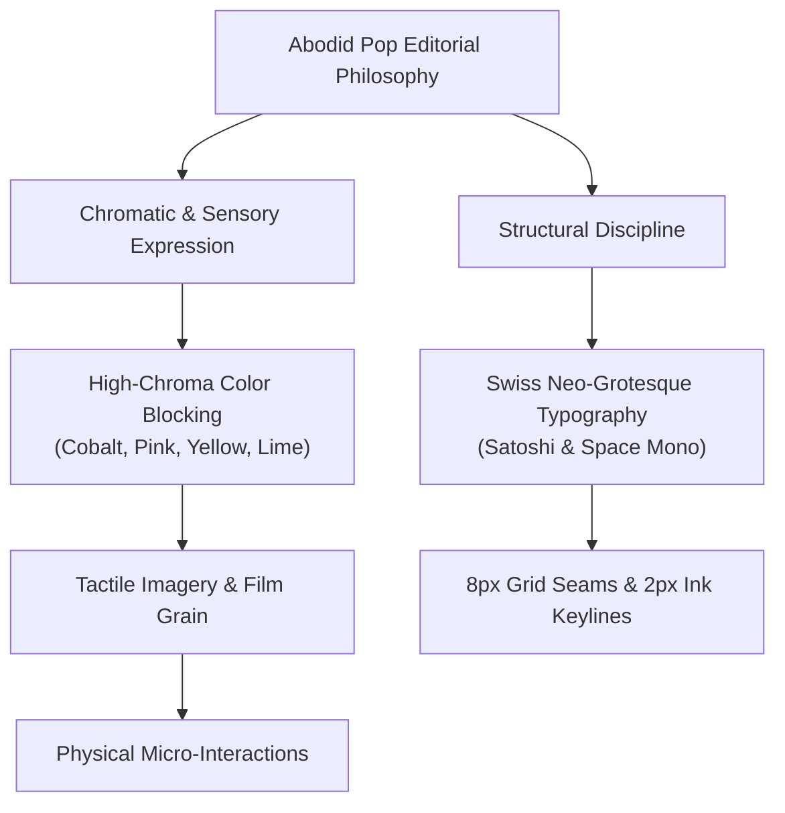

# 03.00 — Abodid Pop Editorial Design System

Status: Current  
Last Updated: 2026-09-18  

---

## 1. Aesthetic Character and Foundations

**Abodid Pop Editorial** is the core design philosophy powering the visual identity of `abodid.com`. It merges Swiss modernist typographic discipline with playful, tactile, high-chroma pop-art sensibilities.

---

## 2. Core Principles

1. **Color as Architecture**: Color fields act as physical floorplans rather than superficial decoration. Transitions between sections are articulated through purposeful shifts in background chroma (e.g., Cobalt `#2444ca` to Hot Pink `#ff7eb5` to Warm Cream `#fff8e8`).
2. **The 8px Structural Rhythm**: An invariant `--pop-gap: 8px` defines the structural seams between cards, panels, and media containers.
3. **Keyline Outlines**: Elements feel printed and physical through thin, high-contrast dark keylines (`--pop-border: rgba(21, 19, 15, 0.78)`).
4. **Controlled Radii Hierarchy**:
   - Large Panels: `clamp(18px, 2vw, 28px)`
   - Cards: `clamp(14px, 1.5vw, 22px)`
   - Interactive Controls: `14px`
   - Inset Media: `clamp(10px, 1.2vw, 16px)`
5. **No Decorative Shadows or Glassmorphism**: Forbid generic SaaS gradients, heavy blur drop-shadows, and faux frosted glass. Shadows are restricted to subtle `rgba(21, 19, 15, 0.08)` hover elevation.
