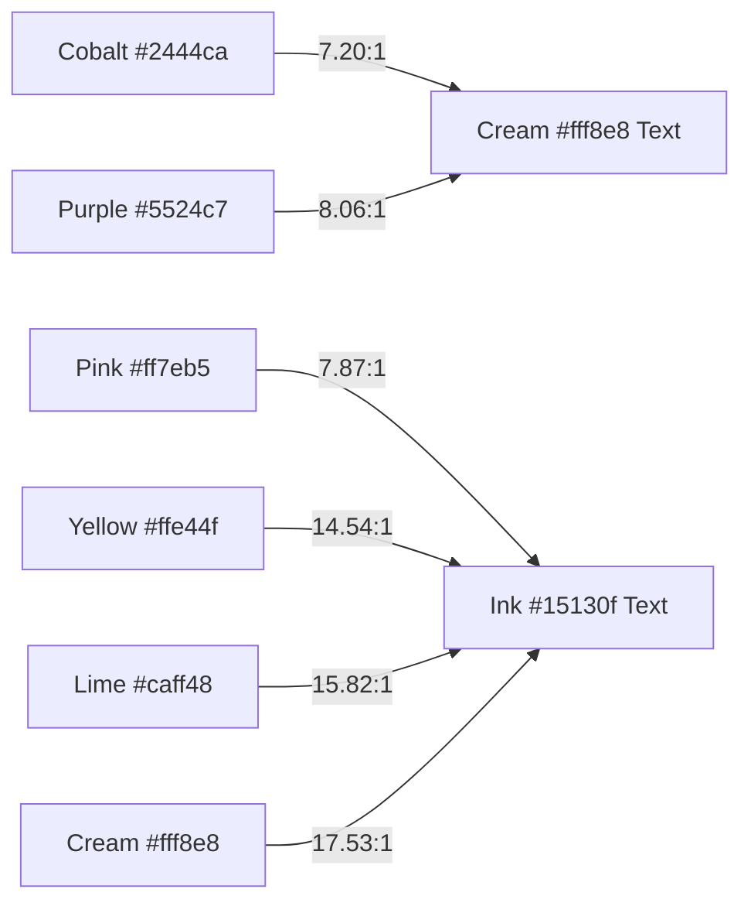

# 03.02 — Color Palette, Design Tokens, and Overlays

Status: Current  
Last Updated: 2026-09-18  

---

## 1. Canonical Color Tokens

The visual palette is defined by 11 immutable CSS custom properties:

```css
:root {
  --pop-blue:   #2444ca; /* Cobalt */
  --pop-pink:   #ff7eb5; /* Hot Pink */
  --pop-yellow: #ffe44f; /* Acid Yellow */
  --pop-lime:   #caff48; /* High-Chroma Lime */
  --pop-orange: #ff875c; /* Warm Orange */
  --pop-purple: #5524c7; /* Deep Violet */
  --pop-cyan:   #62e6ff; /* Electric Cyan */
  --pop-cream:  #fff8e8; /* Warm Paper Cream */
  --pop-ink:    #15130f; /* Near-Black Ink */
  --pop-border: rgba(21, 19, 15, 0.78); /* High-contrast Keyline */
  --pop-line:   rgba(21, 19, 15, 0.24); /* Subtle Divider */
}
```

---

## 2. WCAG Contrast and Pairing Matrix

To maintain accessible readability, foreground colors are paired strictly according to contrast thresholds:



### Contrast Invariants:
- **Forbidden**: Never place `--pop-ink` text on `--pop-blue` (2.43:1) or `--pop-purple` (2.18:1).
- **Forbidden**: Never place `--pop-cream` text on `--pop-pink`, `--pop-yellow`, or `--pop-lime`.

---

## 3. Grain Texture and Overlays

To evoke the tactile grain of 35mm film and risograph print:
- A subtle SVG noise filter (`src/styles/grain.css`) is composited over the body background:
  ```css
  .grain-overlay {
    position: fixed;
    top: 0; left: 0; width: 100vw; height: 100vh;
    pointer-events: none;
    z-index: 9999;
    opacity: 0.035;
    background-image: url("data:image/svg+xml,...");
  }
  ```
- **Performance Invariant**: Uses hardware-accelerated static SVG noise with `pointer-events: none` to ensure zero impact on scroll framerates.
