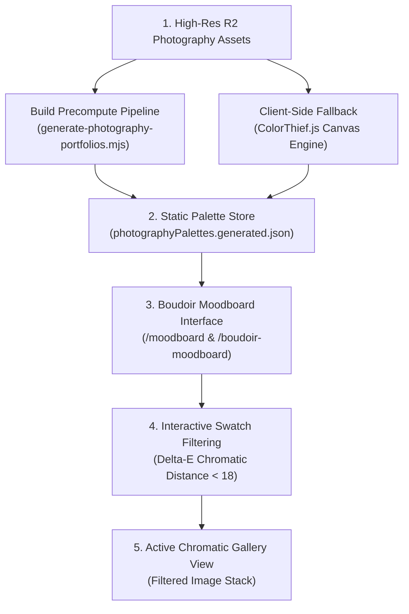

# 03.04 — Moodboard and Dynamic Palette Extraction

Status: Current  
Last Updated: 2026-09-18  

---

## 1. Architectural Purpose

The **Moodboard System** (including `/moodboard` and the **Boudoir Viewer** at `/boudoir-moodboard`) is an interactive visual curation engine that bridges photography, fashion archives, and color theory.

Rather than presenting static photographic contact sheets, the system dynamically analyzes color harmony, surfaces dominant swatches, and allows visitors to filter and explore images chromatically.

---

## 2. Dynamic Palette Extraction Pipeline

### 2.1. Server-Side Precomputation
During asset build, `scripts/generate-photography-portfolios.mjs` executes `colorthief` against every image original:
1. Loads image buffer into Node memory.
2. Extracts 5 dominant quantized RGB color clusters.
3. Converts RGB values to hex codes and calculates luminance.
4. Generates `src/data/photographyPalettes.generated.json`.

### 2.2. Interactive Swatch Mechanics
- **Interface**: Each image card displays its 5-swatch palette pill.
- **Click-Based Color Filtering**: Clicking an individual swatch highlights all images in the active collection containing perceptually similar tones (Delta-E color distance `< 18`).
- **Rationale**: Elevates color from a passive visual property into an active exploration tool for art directors and designers.
