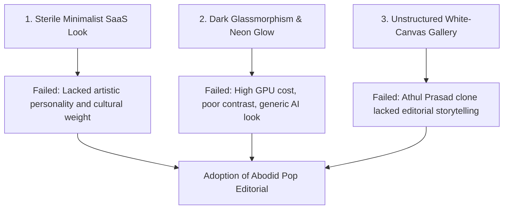

# 03.05 — Rejected Visual Directions and Postmortems

Status: Historical / Postmortem  
Last Updated: 2026-09-18  

---

## 1. Catalog of Rejected Visual Directions

The current **Abodid Pop Editorial** system was forged through the explicit rejection of several common web design tropes:

---

## 2. Specific Postmortems

### 2.1. Rejection of the Sterile Monochrome Template
- **Attempted**: Standard black-and-white grid with heavy whitespace and tiny 12px sans-serif labels.
- **Symptom**: Looked like an off-the-shelf portfolio theme; failed to communicate spatial architecture or cultural energy.
- **Correction**: Introduced bold color-blocking (Cobalt, Pink, Lime) and poster-scale Satoshi headings (`clamp(3rem, 6.7vw, 7rem)`).

### 2.2. Rejection of Glassmorphism and Backdrop Blurs
- **Attempted**: Translucent floating cards with heavy `backdrop-filter: blur(20px)` and purple-blue linear gradients.
- **Underlying Cause**: Caused severe mobile GPU frame drops during fast scrolling and produced an artificial "AI-generated crypto landing page" feel.
- **Correction**: Replaced blurred overlays with solid color fills, crisp 1px ink keylines, and tactile 35mm SVG film grain.

### 2.3. Rejection of Utility-Class Bloat (Tailwind)
- **Attempted**: Thousands of inline atomic Tailwind utility classes across Astro components.
- **Problem**: Obscured semantic markup, made global color theme adjustments brittle, and produced massive HTML payloads.
- **Correction**: Standardized on scoped Vanilla CSS with centralized CSS custom properties in `src/styles/global.css`.
