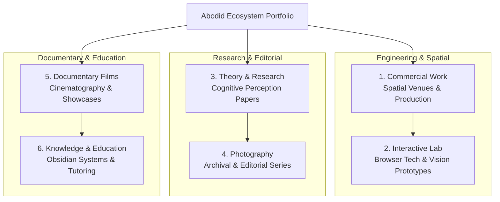

# 04.00 — Project Taxonomy and Case Study Structure

Status: Current  
Last Updated: 2026-09-18  

---

## 1. Project Taxonomy and Categories

The ecosystem categorizes all creative and technical outputs into defined disciplines:

| Category | Primary Route | Storage Model | Key Deliverable |
| :--- | :--- | :--- | :--- |
| **Work** | `/work/[slug]` | `portfolio_projects` | Spatial venues, brand campaigns, major institutional builds. |
| **Lab** | `/lab/[slug]` | `portfolio_projects` (Lab tax) | Real-time computer vision prototypes, browser experiments. |
| **Research** | `/research/[slug]` | `research_papers` / Blocks | Academic papers, cognitive perception studies, essays. |
| **Photography** | `/photography/[...slug]` | R2 JSON Manifests | Series-level editorial and documentary photographic collections. |
| **Films** | `/films/[slug]` | `films` table | Narrative documentaries, cinema showcases, brand films. |
| **Education** | `/obsidian-tutoring`, `/workshops` | Static / Services DB | Obsidian knowledge courses, video editing masterclasses. |

---

## 2. Standard Case Study Analytical Template

For significant projects, documentation follows an invariant 10-step analytical sequence:

$$\text{Problem} \rightarrow \text{Idea} \rightarrow \text{Research} \rightarrow \text{Design} \rightarrow \text{Architecture} \rightarrow \text{Implementation} \rightarrow \text{Problems} \rightarrow \text{Corrections} \rightarrow \text{Current State} \rightarrow \text{Future Possibilities}$$

### Breakdown of Sections:
1. **Problem**: Clear statement of the creative, spatial, or technical friction.
2. **Idea**: Conceptual hypothesis or experiential direction.
3. **Research**: Historical precedents, user interviews, literature, or technical feasibility studies.
4. **Design**: Spatial floorplans, wireframes, Pop Editorial color-blocking, and typography treatments.
5. **Architecture**: Technology stack, database schemas, API routes, and state lifecycle.
6. **Implementation**: Code execution, on-site physical fabrication, or media processing.
7. **Problems Encountered**: Real-world bugs, GPU bottlenecks, fabrication delays, or AI hallucinations.
8. **Corrections Applied**: Concrete technical or design fixes applied in response to failure.
9. **Current State**: Live production status and verified audience metrics.
10. **Future Possibilities**: Speculative v2 directions and uncommitted features.
