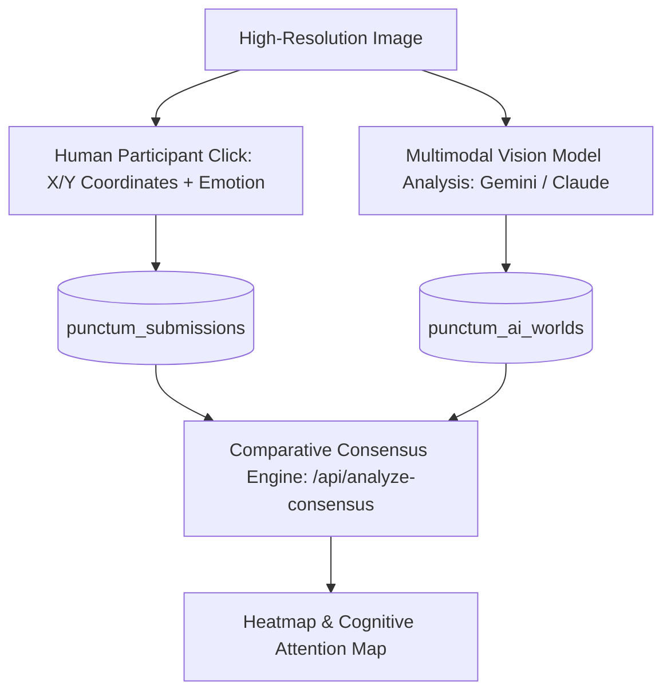

# 04.01 — The Punctum Research Suite

Status: Current  
Last Updated: 2026-09-18  

---

## 1. Theoretical Foundation: Roland Barthes and Visual Punctum

The **Punctum Suite** (`/lab/punctum`) is an interactive research environment investigating Roland Barthes’ classic distinction in *Camera Lucida* (1980):
- **Studium**: The polite, culturally conditioned, semantic interest in a photograph (what the photographer intended to show).
- **Punctum**: The involuntary, personal, unnameable detail that pierces or wounds the spectator.

---

## 2. Subsystems and Architecture

### 2.1. Invisible Punctum Participatory Experiment
- **Participant Flow**: Visitors view uncaptioned archival photographs and click the single sub-region that instinctively arrests their attention.
- **Data Capture**: Records normalized coordinate floats `(x: 0.0–1.0, y: 0.0–1.0)`, emotional response tags (`grief`, `nostalgia`, `longing`, `unease`, `joy`), and freeform reasoning.
- **Privacy & Security**: Anonymous session tokens via Supabase Auth; Cloudflare Turnstile token validation; rate-limited to 12 sessions per IP per hour.

### 2.2. AI Worlds Generation
- Autonomous pipeline extracting multimodal interpretations across 5 distinct prompt lenses (Formalist, Psychoanalytic, Historical, Semiotic, Visceral).
- Compares synthetic AI attention regions against aggregate human click clusters to identify where machine vision systematically misjudges human emotional resonance.

### 2.3. Project Case Study: Punctum
- **Problem**: Machine vision models reduce photographs to superficial object bounding boxes (e.g., "person, tree, car"), completely ignoring subjective emotional weight.
- **Idea**: Build a live coordinate-mapping platform to empirically map human punctum vs LLM semantic attention.
- **Implementation**: Canvas-based SVG overlay with dynamic DBSCAN spatial clustering in Postgres.
- **Current State**: Active participatory research dataset with live visual results.
- **Future Possibilities**: Real-time eye-tracking integration via WebGazer and WebXR headset integration.
