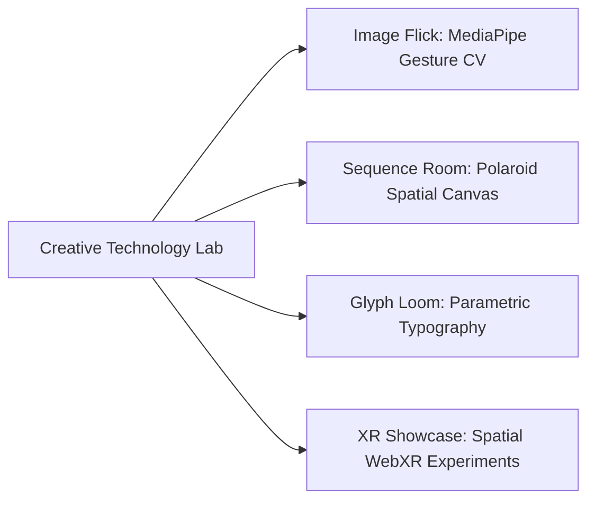

# 04.02 — Lab Experiments and Creative Technology Prototypes

Status: Current  
Last Updated: 2026-09-18  

---

## 1. The Lab Overview (`/lab`)

The Lab is a staging ground for sensory digital prototypes, physical-computing bridges, and real-time computer vision interfaces.

---

## 2. Core Experiments

### 2.1. Image Flick (`/lab/image-flick`)
- **Technology**: `@mediapipe/camera_utils`, `@tensorflow-models/hand-pose-detection`, WebGL backend.
- **Mechanism**: Captures live webcam stream in an isolated Web Worker; calculates vector velocity of the index fingertip. When horizontal velocity exceeds threshold $v > 1.2\text{ m/s}$, dispatches a zero-touch physics "flick" across the 3D CSS image stack.
- **Fallback**: Graceful downgrade to touch swipes and mouse drag on unsupported hardware.

### 2.2. Sequence Room (`/lab/sequence-room`)
- **Concept**: A spatial, tactile editing table for photographers and film directors.
- **Technology**: React, `@dnd-kit/core`, `@dnd-kit/sortable`, HTML5 Canvas.
- **Interaction**: Drag, rotate, group, and annotate Polaroid-style photographic prints on an infinite pan/zoom canvas. Supports instant export to PDF storyboards.

### 2.3. Glyph Loom (`/lab/glyph-loom`)
- **Concept**: Interactive generative typography tool.
- **Technology**: `opentype.js`, HTML Canvas, parametric Bézier curve distortion algorithms.

### 2.4. XR Showcase (`/xr-showcase`)
- **Concept**: Interactive spatial computing and 3D architectural viewer.
- **Technology**: WebGL, Three.js / Babylon bindings, dynamic JSON asset manifest (`src/data/xr-showcase.generated.json`).
