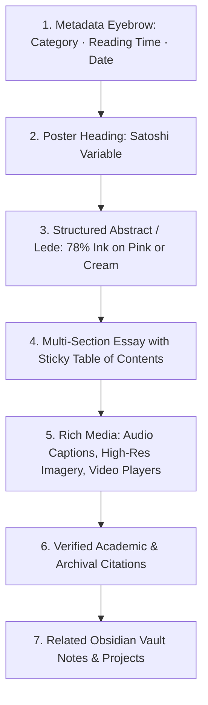

# 04.03 — Long-Form Editorial and Research Papers

Status: Current  
Last Updated: 2026-09-18  

---

## 1. Editorial Layout Structure

Long-form essays (`/blog/[...slug]`) and academic research papers (`/research-papers/[slug]`) adhere to a standardized, high-density editorial hierarchy:

---

## 2. Representative Long-Form Case Studies

### 2.1. *From an Abandoned Garage into the Hottest Exhibition Spot in London*
- **URL**: `/blog/from-an-abandoned-garage-into-the-hottest-exhibition-spot-in-london-in-just-two-days`
- **Focus**: Behind-the-scenes spatial architectural production of *Into the Flux* for the International Body of Art (IBA).
- **Structure**: 
  - Structural venue analysis & floorplan choreography.
  - 48-hour build timeline and visitor circulation bottlenecks.
  - High-resolution documentary photography embeds.
  - Verified outcome metrics: 10,000+ visitors in 48 hours.

### 2.2. *Cognitive Attention in Visual Theory and AI*
- **URL**: `/research-papers/cognitive-attention-in-visual-theory`
- **Focus**: Formal academic paper outlining the *Invisible Punctum* methodology.
- **Structure**: Abstract, literature review (Barthes, Sontag, Benjamin), algorithmic methodology, empirical DBSCAN cluster analysis, and open discussion.

---

## 3. Editorial Metadata Standards

Every article mandates the following YAML/Database properties:
- `title`: Precise, descriptive, free of clickbait phrasing.
- `description`: 140–160 character summary for meta descriptions and OpenGraph cards.
- `readingTime`: Estimated calculated reading duration.
- `citations`: Array of external verified bibliographic references with DOIs or canonical URLs.
