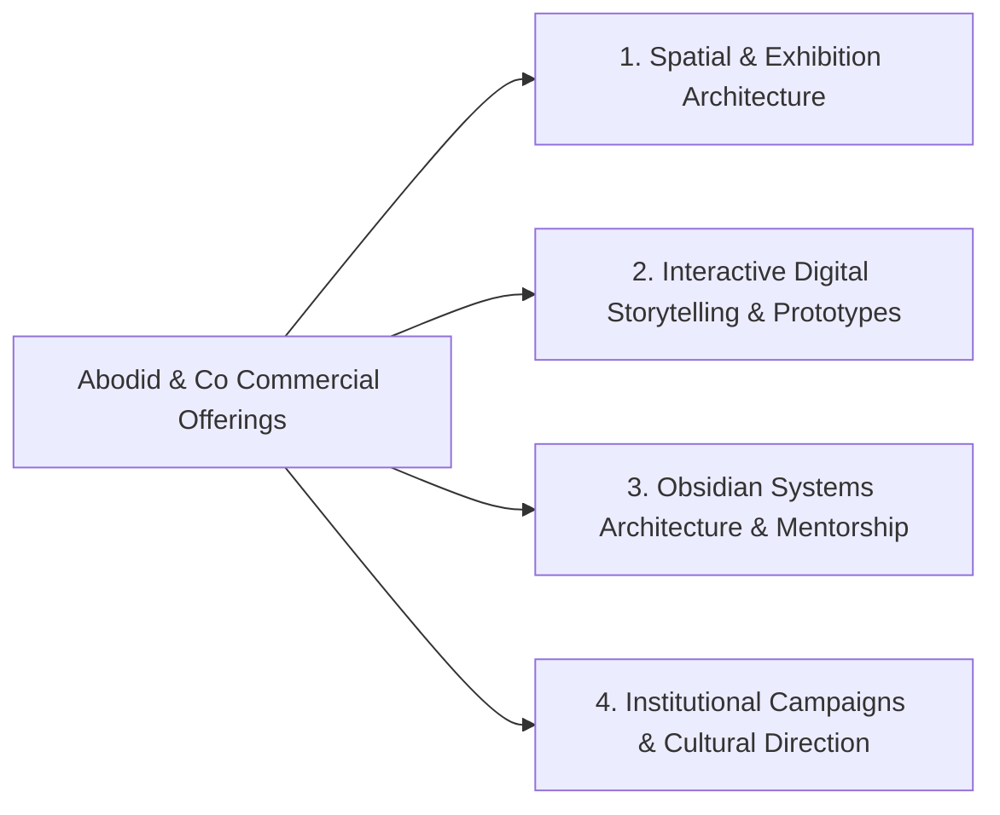

# 04.04 — Commercial Platforms, Tutoring, and Client Delivery

Status: Current  
Last Updated: 2026-09-18  

---

## 1. Commercial Service Architecture

Commercial offerings (`/services`, `/studio`, `/obsidian-tutoring`) are organized into four dedicated tiers:

---

## 2. Specialized Platforms

### 2.1. Obsidian Tutoring and Systems Mentorship (`/obsidian-tutoring`)
- **Target Audience**: Film directors, principal researchers, agency heads, and doctoral candidates managing complex multi-gigabyte personal knowledge graphs.
- **Curriculum**: Vault taxonomy design, semantic wikilinking, automated citation harvesting, custom CSS theming, and local LLM/RAG integration.
- **Booking Flow**: Structured intake questionnaire feeding directly into Supabase contact leads.

### 2.2. Supercut Club (`/supercutclub`)
- **Concept**: A selective community and matching platform connecting professional video editors with high-caliber directors and brands.
- **Features**: Curator-moderated portfolio reviews, timeline challenge submissions, and talent matching workflows.

### 2.3. Private Client Deliverable Delivery
- **Architecture**: Authenticated private photography proofing and archive delivery.
- **Delivery Engine**: Presigned Cloudflare R2 URLs generated on-demand with 72-hour expiration headers. Protects high-resolution TIFF/RAW originals from unauthorized scraping.
