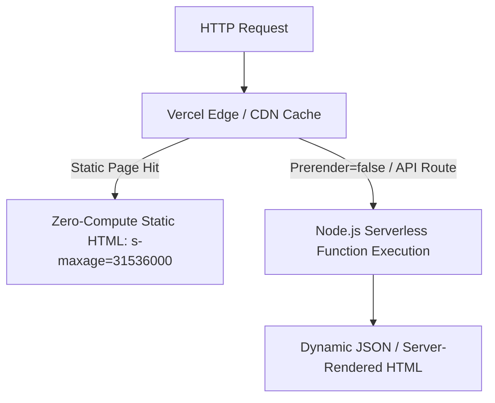

# 05.00 — Astro Core and Rendering Strategy

Status: Current  
Last Updated: 2026-09-18  

---

## 1. Astro Framework Core

The entire application is built on **Astro 5.x** (`astro@^5.16.8`) configured with the `@astrojs/vercel` adapter in `output: 'static'` mode.



---

## 2. Rendering Invariants

### 2.1. Static Prerendering by Default
- The global default is `output: 'static'`. Public pages (Home, Work case studies, Photography series, Essays, Vault notes) are pre-rendered into static HTML during the build step.
- **Benefit**: Sub-50ms TTFB worldwide, zero runtime database connections for public pageviews, and near-zero Vercel Fluid Active CPU consumption.

### 2.2. Selective On-Demand SSR (`prerender = false`)
- Dynamic endpoints (e.g., `/api/analytics/collect`, `/api/chat`, `/api/punctum/submit`, `/api/vault-chat`, `/admin/dashboard`) opt into server-side execution by declaring:
  ```typescript
  export const prerender = false;
  ```
- Executed inside standard Node.js serverless runtimes.

### 2.3. Island Hydration Architecture
- Static HTML is sent to the client with zero JavaScript by default.
- Interactive components (React / Svelte islands) hydrate selectively:
  - `client:load`: High-priority interactive controls (e.g., mobile menu drawer, audio caption toggle).
  - `client:visible`: Heavy media components (e.g., Chart.js analytics graphs, Sequence Room canvas).
  - `client:only="react"`: Components requiring browser-only DOM access (e.g., MediaPipe gesture tracker).
