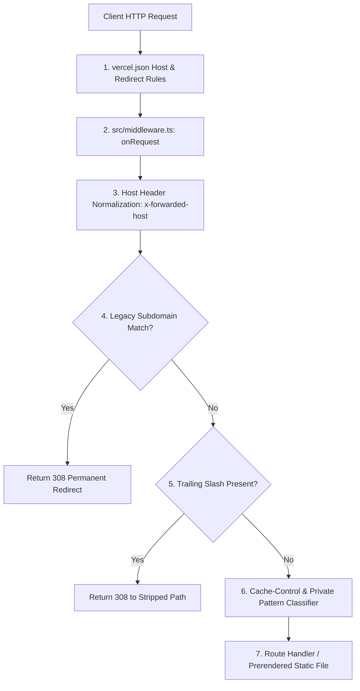

# 05.02 — Middleware Pipeline and Request Routing

Status: Current  
Last Updated: 2026-09-18  

---

## 1. Request Lifecycle Architecture

Every incoming HTTP request passes through a multi-tiered routing and filtering pipeline:



---

## 2. Invariants in `src/middleware.ts`

### 2.1. Node.js Runtime vs Edge Middleware
- Root `middleware.js` is deprecated because `@astrojs/vercel` compiles routing directly into `src/middleware.ts`.
- Running Astro middleware in standard Node.js serverless execution eliminates CDN cache pollution across unrelated pages.

### 2.2. Private Pattern Enforcement
- Requests matching private patterns (`/admin/*`, `/api/admin/*`, `/api/analytics/*`, `/login`, `/opportunities/*`, `/resources/admin/*`) automatically have their response headers overridden:
  ```http
  Cache-Control: private, no-store
  Vercel-CDN-Cache-Control: no-store
  ```
- Guarantees that authenticated views or private telemetry are never cached in shared CDN edge points.

### 2.3. Public Edge Cache Headers
- Verified static or public SSR responses receive long-lived stale-while-revalidate headers:
  ```http
  Cache-Control: public, max-age=0, must-revalidate
  Vercel-CDN-Cache-Control: s-maxage=31536000, stale-while-revalidate=86400
  ```
