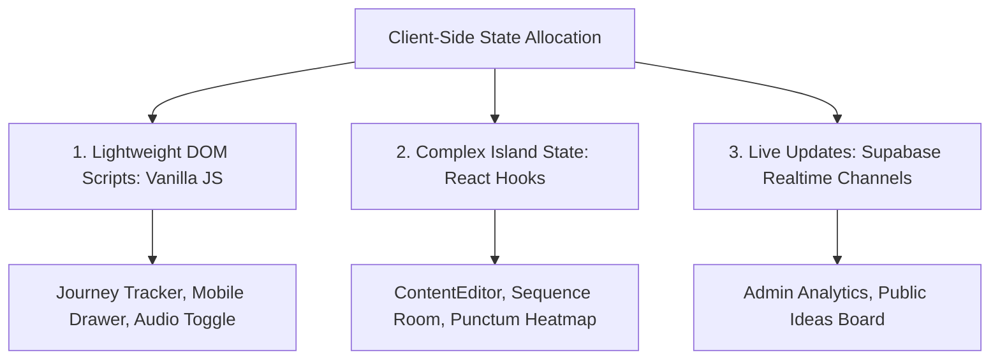

# 05.03 — Client-Side State, DnD, and Animations

Status: Current  
Last Updated: 2026-09-18  

---

## 1. Client-Side State Strategy

The application avoids monolithic client frameworks (like Redux or global Zustand) in favor of localized, purpose-fit state models:

---

## 2. Specialized Client Libraries

### 2.1. Drag-and-Drop Architecture (`@dnd-kit`)
- Used in the **Sequence Room** (`/lab/sequence-room`) and **Portfolio Block Admin** (`/admin/projects/[slug]`).
- Utilizes `@dnd-kit/core` and `@dnd-kit/sortable` with collision detection algorithms (`closestCenter`) and keyboard accessibility sensors.

### 2.2. Data Visualization (`Chart.js` & `react-chartjs-2`)
- Powers the Admin Analytics dashboard (`/admin/dashboard?section=analytics`).
- Renders real-time human session timelines, country distributions, traffic acquisition sources, and navigation drop-off curves.

### 2.3. Animation and Micro-Interactions (`GSAP` / `Framer Motion`)
- Complex spatial transforms, smooth card staggering, and SVG path morphing are managed via GSAP and Framer Motion.
- All animations respect `prefers-reduced-motion: reduce` by zeroing transition durations.
