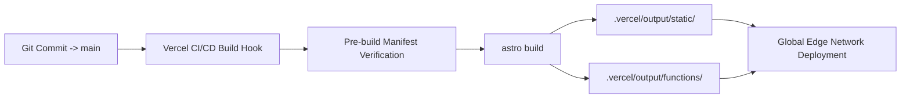

# 05.04 — Build Pipeline, Vite Optimization, and Vercel Output

Status: Current  
Last Updated: 2026-09-18  

---

## 1. Build and Deployment Architecture

The build process is orchestrated via Astro, Vite, and the Vercel Build Output API v3:



---

## 2. Vite Cache and Workspace Isolation

In `astro.config.mjs`, Vite is configured to isolate development and production dependency caches:

```javascript
vite: {
  cacheDir: isDevelopmentServer
    ? 'node_modules/.vite/development'
    : 'node_modules/.vite/production',
  server: {
    watch: {
      ignored: ['**/.vercel/**'],
    },
  },
  resolve: {
    dedupe: ['react', 'react-dom'],
  },
}
```

### 2.1. Why Cache Directory Isolation is Critical
- Prevents long-running local development servers from corrupting chunk manifests when production builds run in parallel.
- Ignoring `**/.vercel/**` file watch events prevents file descriptor exhaustion during rapid builds.

---

## 3. Production Build Validation

To validate production builds locally:
```bash
# 1. Clean stale build artifacts
npm run clean

# 2. Execute static compilation and type checks
npm run build

# 3. Preview production output locally
npm run preview
```
