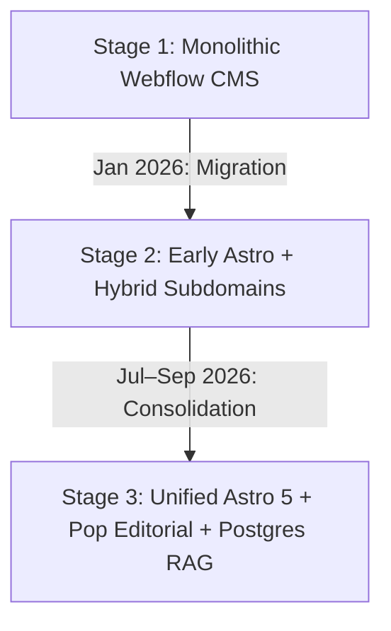

# 05.05 — Major Architectural Revamps and Structural Refactors

Status: Historical / Current  
Last Updated: 2026-09-18  

---

## 1. Timeline of Foundational Architectural Shifts

The `abodid.com` ecosystem evolved through three major paradigm shifts:

---

## 2. Detailed Breakdown of Major Revamps

### 2.1. Webflow to Astro SSR/SSG Migration (January 2026)
- **Driver**: Webflow lacked custom WebGL shaders, real-time computer vision capabilities, and programmatic database queries.
- **Action**: Completely rebuilt the site using Astro. Dropped all Webflow CMS tables and exported assets to Cloudflare R2 (`20260127_cleanup_webflow_tables.sql`).
- **Outcome**: Page load times dropped from ~2.8s to <350ms; enabled embedded TensorFlow and MediaPipe experiments.

### 2.2. Unified Work Portfolio CMS Migration (July 2026)
- **Driver**: Legacy architecture maintained fragmented, disconnected tables (`blog_posts`, `journal_entries`, `photo_stories`, `research_projects`).
- **Action**: Created unified `portfolio_projects`, `portfolio_revisions`, and `portfolio_blocks` schema (`20260711160000_create_unified_work_portfolio.sql`).
- **Outcome**: Atomic draft-saving, immutable revision snapshots, lock-version concurrency protection, and a unified rich-block editor.

### 2.3. Subdomain Consolidation and Root Vault Migration (August–September 2026)
- **Driver**: Fragmenting products across `curation.abodid.com`, `lab.abodid.com`, and `photos.abodid.com` diluted domain authority and complicated cookie sharing.
- **Action**: Consolidated subdomains to canonical path namespaces (`/resources`, `/lab`, `/photography-portfolio`, `/obsidian-vault`) with permanent 308 redirects in Vercel.
- **Outcome**: Strengthened apex SEO rank and unified analytics under a single origin.
