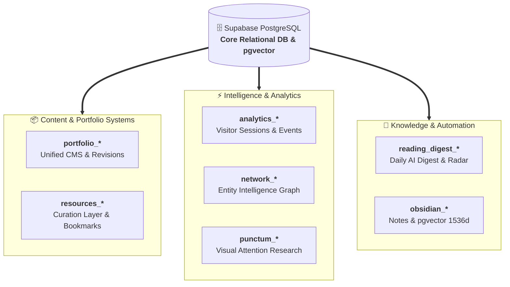

# 06.00 — Supabase Postgres Schema and Table Specifications

Status: Current  
Last Updated: 2026-09-18  

---

## 1. Database Architecture Overview

The backend is powered by a hosted PostgreSQL instance on Supabase. Tables are partitioned by functional domain using consistent naming prefixes:

### 1.1. Domain Prefix Directory

| Domain Prefix | Primary Subsystem | Core Tables |
| :--- | :--- | :--- |
| `portfolio_*` | **Unified Work Portfolio & CMS** | `portfolio_projects`, `portfolio_revisions`, `portfolio_blocks` |
| `resources_*` | **Curation Layer & Tools Directory** | `resources`, `resource_categories`, `user_bookmarks` |
| `analytics_*` | **Visitor Tracking & Intelligence** | `analytics_sessions`, `analytics_page_views`, `analytics_events` |
| `network_*` | **Network & Contact Graph** | `network_contacts`, `network_interactions`, `network_tags` |
| `punctum_*` | **Attention Research Suite** | `punctum_submissions`, `punctum_ai_worlds` |
| `reading_digest_*` | **AI Autonomous Digest & Radar** | `reading_digest_runs`, `reading_digest_items` |
| `obsidian_*` | **Obsidian Vault & Vector RAG** | `obsidian_notes`, `obsidian_chunks` |

---

## 2. Core Table Schemas

### 2.1. Unified Work Portfolio
- `portfolio_projects`: Stable project identity (`id`, `slug`, `title`, `pillar`, `status`, `public_order`, `draft_revision_id`, `published_revision_id`).
- `portfolio_revisions`: Immutable revision snapshots (`id`, `project_id`, `lock_version`, `title`, `summary`, `cover_url`, `created_at`).
- `portfolio_blocks`: Ordered semantic content blocks (`id`, `revision_id`, `block_type`, `position`, `content`, `settings`).

### 2.2. Resources and Curation Layer
- `resources`: Curated tools and references (`id`, `title`, `description`, `url`, `category_id`, `status`, `submitted_by`).
- `resource_categories`: Taxonomy groupings (`id`, `slug`, `label`).
- `user_bookmarks`: Curator bookmarks (`user_id`, `resource_id`, `created_at`).

### 2.3. Analytics and Visitor Intelligence
- `analytics_sessions`: Anonymous visitor sessions (`session_id`, `country_code`, `device_type`, `is_human`, `dwell_seconds`).
- `analytics_page_views`: Pageview records (`id`, `session_id`, `path`, `referrer`, `duration_ms`).
- `analytics_events`: Micro-events (`id`, `session_id`, `event_type`, `event_data`).

### 2.4. Punctum Suite
- `punctum_submissions`: Coordinate annotations (`id`, `image_slug`, `x_coord`, `y_coord`, `emotion`, `comment`).
- `punctum_ai_worlds`: Multimodal AI extractions (`id`, `image_slug`, `model_name`, `world_type`, `focus_coordinates`, `critique`).

### 2.5. Obsidian Knowledge System
- `obsidian_notes`: Flattened metadata index (`note_id`, `file_path`, `title`, `slug`, `frontmatter`, `backlinks`).
- `obsidian_chunks`: Text segments with pgvector embeddings (`id`, `file_path`, `chunk_index`, `content`, `embedding` vector(1536), `is_public`).
