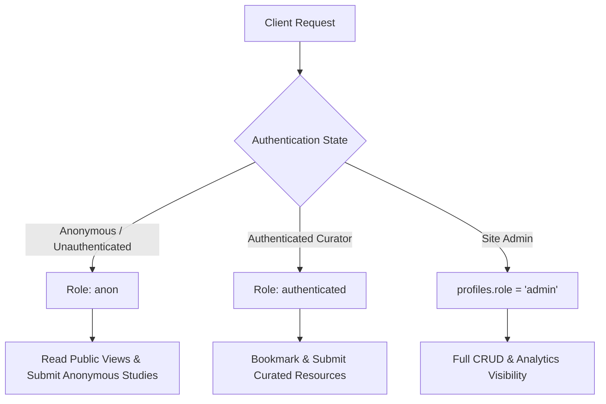

# 06.01 — Row Level Security, Policies, and Authentication

Status: Current  
Last Updated: 2026-09-18  

---

## 1. Authentication and Authorization Model

The application enforces a strict separation between public anonymous interaction, registered curator profiles, and administrator management:



---

## 2. Row Level Security (RLS) Invariants

All tables in the public Postgres schema have `ROW LEVEL SECURITY` enabled. Direct table modifications are forbidden to unauthenticated clients.

### 2.1. Anonymous Access Rules
- Anonymous clients (`role = 'anon'`) are granted `SELECT` permissions only on published, public views (e.g., `portfolio_published_projects_view`, `resources_public_view`).
- Submissions to interactive experiments (`punctum_submissions`, `analytics_events`) are permitted via restrictive `INSERT` policies validating Turnstile verification tokens.

### 2.2. Administrator Mutex
- Mutations across `portfolio_*`, `reading_digest_*`, and `network_*` mandate:
  ```sql
  auth.uid() IN (SELECT id FROM profiles WHERE role = 'admin')
  ```
- The Supabase Service Role key (`SUPABASE_SERVICE_ROLE_KEY`) is stored exclusively in backend server environments and is never sent to the browser.
