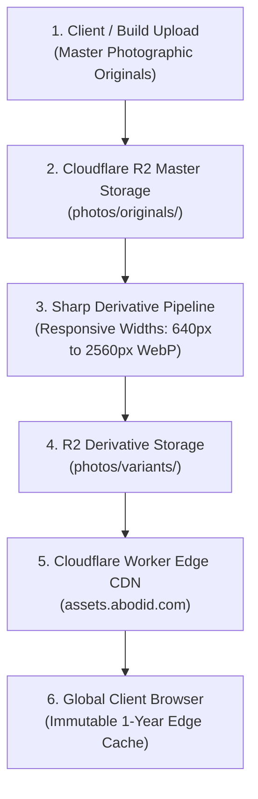

# 06.02 — Cloudflare R2 Media Library and Image Delivery

Status: Current  
Last Updated: 2026-09-18  

---

## 1. Storage Architecture

All media assets (photography, video loops, PDFs, moodboard assets) are stored in **Cloudflare R2** under the canonical bucket `assets`:



---

## 2. Directory Taxonomy

- `photos/originals/<series>/`: Uncompressed, master photographic originals (JPEG/PNG/TIFF).
- `photos/variants/<series>/`: Automated responsive derivatives (WebP, optimized JPEG at widths: 640px, 1280px, 1920px, 2560px).
- `assets/audio/`: Audio voiceovers and ambient soundscapes.
- `assets/videos/`: H.264 / WebM looped preview clips.

---

## 3. Delivery and Optimization Standards

- **Edge Worker CDN**: Public URLs resolve via `https://assets.abodid.com/...`.
- **Immutable Caching**: All R2 media responses declare:
  ```http
  Cache-Control: public, max-age=31536000, immutable
  ```
- **Presigned Uploads**: Direct browser-to-R2 uploads are authenticated via presigned S3 URLs generated by `src/lib/media/r2.ts` with 5-minute expirations.
