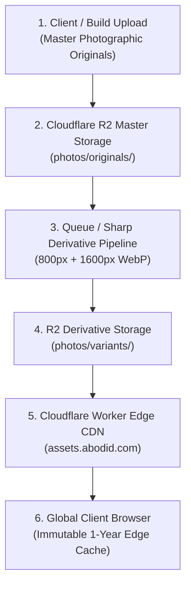

# 06.02 — Cloudflare R2 Media Library and Image Delivery

Status: Current  
Last Updated: 2026-10-02  

---

## 1. Storage Architecture

All media assets (photography, video loops, PDFs, moodboard assets) are stored in **Cloudflare R2** under the canonical bucket `assets`:


```mermaid
flowchart TD
    Upload["1. Client / Build Upload<br/>(Master Photographic Originals)"]
    Originals["2. Cloudflare R2 Master Storage<br/>(photos/originals/)"]
    SharpPipe["3. Queue / Sharp Derivative Pipeline<br/>(800px + 1600px WebP)"]
    Variants["4. R2 Derivative Storage<br/>(photos/variants/)"]
    WorkerCDN["5. Cloudflare Worker Edge CDN<br/>(assets.abodid.com)"]
    Client["6. Global Client Browser<br/>(Immutable 1-Year Edge Cache)"]

    Upload --> Originals --> SharpPipe --> Variants --> WorkerCDN --> Client
```

---

## 2. Directory Taxonomy

- `photos/originals/<series>/`: Master photographic originals (JPEG, PNG, WebP, GIF, and AVIF).
- `photos/originals/moodboard/`: Canonical destination for Chrome, Finder, and admin moodboard capture.
- `photos/variants/<series>/800/`: WebP assets used by grid and thumbnail views.
- `photos/variants/<series>/1600/`: WebP assets used by opened viewers and larger layouts.
- `assets/audio/`: Audio voiceovers and ambient soundscapes.
- `assets/videos/`: H.264 / WebM looped preview clips.

---

## 3. Delivery and Optimization Standards

- **Edge Worker CDN**: Public URLs resolve via `https://assets.abodid.com/...`.
- **Immutable Caching**: All R2 media responses declare:
  ```http
  Cache-Control: public, max-age=31536000, immutable
  ```
- **Presigned Uploads**: Direct browser-to-R2 uploads are authenticated via presigned S3 URLs generated by `src/lib/media/r2.ts` with 5-minute expirations.
- **Animation-aware output**: GIF originals remain untouched; responsive copies are encoded as animated WebP. Quality adapts to source size and frame count, and the backfill verifies that animation frames survived before publishing a variant record.
- **No enlargement**: An original narrower than 800px or 1600px is recompressed into both stable variant locations without being scaled up.
- **Repair command**: `npm run backfill:moodboard-variants -- --dry-run` audits the moodboard folder. Remove `--dry-run` to catalogue missing originals and generate or repair both sizes.

## 4. Moodboard Cache Split

- The dynamic `/moodboard` document uses `s-maxage=60, stale-while-revalidate=300` on Vercel so database changes appear without a website deployment.
- Fingerprinted R2 variants use a one-year immutable cache. A source change creates a new fingerprinted URL instead of trying to purge a global CDN object.
- The grid requests the 800px URL; the opened viewer requests 1600px. Either path falls back to the original while processing is incomplete.
- Supabase stores catalogue data and relationships only. Image bodies travel directly from Chrome or macOS to R2 and from the R2 edge to the visitor.
