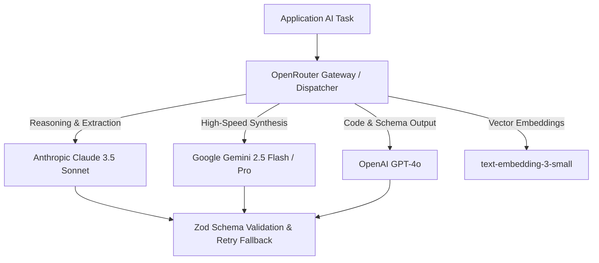

# 08.00 — AI Architecture and Multi-Model Dispatching

Status: Current  
Last Updated: 2026-09-18  

---

## 1. Multi-Model Gateway via OpenRouter

Rather than coupling the system to a single AI provider, all LLM inference and embeddings are routed through **OpenRouter** (`@openrouter/sdk`) and Google GenAI SDK:

---

## 2. Model Selection Logic by Domain

| Domain / Task | Selected Model | Rationale |
| :--- | :--- | :--- |
| **Vault Conversational RAG** | `google/gemini-2.5-flash` | High throughput, sub-second latency, generous context window. |
| **Daily Reading Digest Research** | `openai/gpt-4o` / `anthropic/claude-3.5-sonnet` | Superior citation verification and hallucination resistance. |
| **Opportunity Radar Extraction** | `anthropic/claude-3.5-haiku` / `gemini-2.5-flash` | Low-cost structured JSON extraction from raw scraped HTML. |
| **Punctum Multimodal Vision** | `google/gemini-2.5-pro` | High visual spatial resolution and nuanced semiotic reasoning. |
| **Knowledge Graph Embeddings** | `openai/text-embedding-3-small` | 1536-dimension cosine similarity consistency across Supabase. |

---

## 3. Structured Output Guarantees

- **No Raw Unvalidated Text**: All extraction prompts require JSON output conformant to strict schemas.
- **Validation Pipeline**: Responses are parsed via `zod`. If parsing fails, the system executes one automatic repair retry before recording an error in the audit log.
