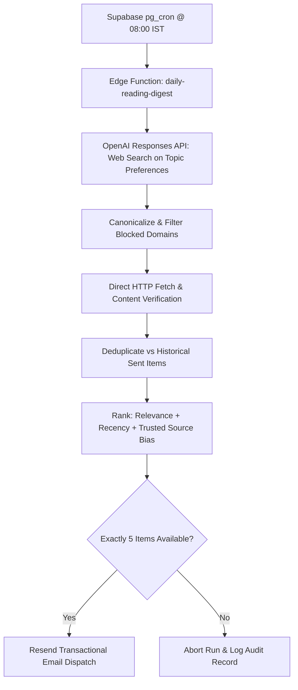

# 08.01 — Automated Pipelines: Reading Digest and Opportunity Radar

Status: Current  
Last Updated: 2026-09-18  

---

## 1. Daily Reading Digest Pipeline

The **Daily Reading Digest** autonomously discovers, verifies, ranks, and delivers 5 high-value essays every morning at **08:00 Asia/Kolkata**:

### 1.1. Invariants of the Digest
1. **Selection Invariant**: Must contain at least 2 recent items and 1 foundational piece. If 5 valid candidates cannot be verified after 2 search rounds, no email is sent.
2. **Idempotency**: Resend receives a deterministic idempotency key (`digest-YYYY-MM-DD`), preventing duplicate emails on retry.
3. **Database Guardrails**: `reading_digest_delivery_items.reading_id` enforces a unique constraint; an article can never appear in two separate deliveries.

---

## 2. Opportunity Radar Scanner

The **Opportunity Radar** (`src/lib/opportunities/`) monitors creative grants, artist residencies, and exhibition open calls:

- **Scraper Engine**: `cheerio`-based HTML fetchers targeting institutional portals (Arts Council England, British Council, Creative Scotland).
- **Extractor**: OpenRouter model parses eligibility, deadlines, funding amounts, and submission URLs.
- **Notification Engine**: Dispatches high-priority reminder alerts to the admin dashboard and email inbox 14 days and 48 hours prior to deadlines.
