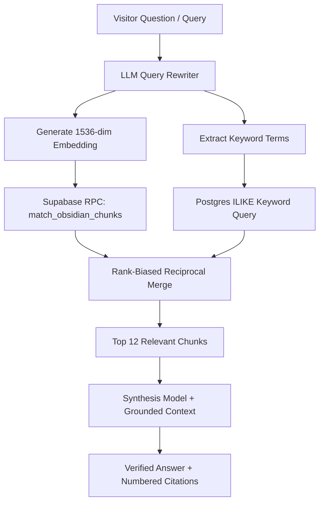

# 08.02 — Embeddings, Semantic Search, and Vault Chat

Status: Current  
Last Updated: 2026-09-18  

---

## 1. Hybrid Search Architecture

To ensure precision and recall, the Obsidian Vault search engine combines vector similarity with BM25-style keyword matching:



---

## 2. Supabase Vector RPC Specification

The match function executes pgvector cosine similarity inside Postgres:

```sql
CREATE OR REPLACE FUNCTION match_obsidian_chunks(
    query_embedding vector(1536),
    match_count int DEFAULT 12,
    match_threshold float DEFAULT 0.16,
    public_only boolean DEFAULT true,
    tag_filter text DEFAULT null,
    folder_filter text DEFAULT null,
    file_path_filter text DEFAULT null
)
RETURNS TABLE (
    id bigint,
    note_id text,
    note_title text,
    file_path text,
    folder_path text,
    heading text,
    chunk_index int,
    chunk_text text,
    tags text[],
    similarity float
)
LANGUAGE plpgsql
AS $$
BEGIN
    RETURN QUERY
    SELECT
        c.id, c.note_id, c.note_title, c.file_path, c.folder_path,
        c.heading, c.chunk_index, c.chunk_text, c.tags,
        1 - (c.embedding <=> query_embedding) AS similarity
    FROM obsidian_chunks c
    WHERE
        (public_only = false OR c.is_public = true)
        AND (tag_filter IS NULL OR tag_filter = ANY(c.tags))
        AND (folder_filter IS NULL OR c.folder_path ILIKE folder_filter || '%')
        AND (file_path_filter IS NULL OR c.file_path = file_path_filter)
        AND (1 - (c.embedding <=> query_embedding)) >= match_threshold
    ORDER BY c.embedding <=> query_embedding
    LIMIT match_count;
END;
$$;
```

---

## 3. Grounded Citation Remapping

- In `/api/vault-chat.js`, the synthesis response uses numeric citation placeholders (`[1]`, `[2]`).
- `remapVisibleCitations()` reconciles the model's citations against actual retrieved source chunks, stripping hallucinated citation numbers and mapping verified citations directly to interactive note backlink pills in the UI.
