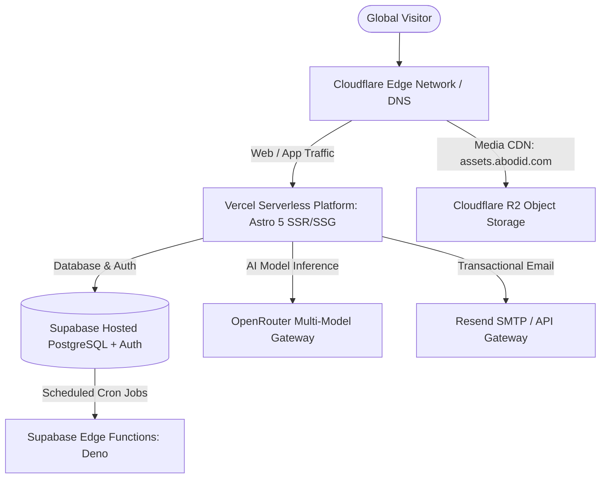

# 09.00 — Infrastructure Topology, Edge Networks, and DNS

Status: Current  
Last Updated: 2026-09-18  

---

## 1. Global Infrastructure Topology

The digital ecosystem is deployed across a multi-cloud network optimized for high availability, sub-50ms static asset delivery, and low serverless compute overhead:

---

## 2. DNS Record Architecture (Cloudflare)

DNS zones are managed within Cloudflare under strict SSL/TLS Full (Strict) configuration:

| Record Type | Host / Name | Target / Destination | Proxy Status | Purpose |
| :--- | :--- | :--- | :--- | :--- |
| `CNAME` | `@` (`abodid.com`) | `cname.vercel-dns.com` | Proxied | Apex website routing via Vercel Edge. |
| `CNAME` | `www` | `cname.vercel-dns.com` | Proxied | Subdomain redirect alias to apex origin. |
| `CNAME` | `assets` | `<account-id>.r2.cloudflarestorage.com` | Proxied | High-throughput media CDN worker. |
| `CNAME` | `lab` | `cname.vercel-dns.com` | Proxied | Subdomain redirect to `https://abodid.com/lab`. |
| `CNAME` | `curation` | `cname.vercel-dns.com` | Proxied | Subdomain redirect to `https://abodid.com/resources`. |
| `CNAME` | `photos` | `cname.vercel-dns.com` | Proxied | Subdomain redirect to `https://abodid.com/photography-portfolio`. |
| `TXT` | `@` | `v=spf1 include:resend.com ~all` | DNS Only | SPF email authentication for Resend. |
| `CNAME` | `resend._domainkey` | `resend._domainkey.abodid.com` | DNS Only | DKIM cryptographic signature for email. |
| `TXT` | `_dmarc` | `v=DMARC1; p=quarantine;` | DNS Only | DMARC domain protection policy. |
