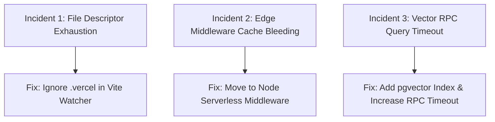

# 09.02 — Operational Incident Postmortems and Troubleshooting

Status: Historical / Current  
Last Updated: 2026-09-18  

---

## 1. Incident Postmortems

This operational log documents real-world bugs, performance degradation incidents, and deployment failures resolved across the lifecycle of the ecosystem:

---

## 2. Postmortems: Problem → Cause → Fix → Prevention

### 2.1. Incident 1: Local Server Crash on Parallel Production Builds
- **Problem**: Running `npm run build` while `npm run dev` was active caused the local dev server to crash with `EMFILE: too many open files`.
- **Cause**: Vercel's build adapter writes thousands of intermediate files into `.vercel/output/`. The local Vite file watcher attempted to register file-system watch handles for every new file, exhausting OS file descriptors.
- **Fix**: Updated `astro.config.mjs` to explicitly ignore `**/.vercel/**` in `vite.server.watch.ignored`.
- **Prevention**: Never allow build artifact output directories to be monitored by active development file watchers.

### 2.2. Incident 2: CDN Cache Bleeding Across Subdomain Routes
- **Problem**: Edge middleware responses on `curation.abodid.com` were cached at CDN edge nodes and accidentally served to subsequent requests on `lab.abodid.com`.
- **Cause**: Vercel Edge Middleware routed through a shared internal `/_render` path, causing downstream CDN caches to conflate hostname cache keys.
- **Fix**: Migrated hostname redirection logic out of Edge middleware and into `vercel.json` and standard Node.js serverless middleware (`src/middleware.ts`).
- **Prevention**: Enforce host-level redirects at the infrastructure gateway layer (`vercel.json`) rather than in shared multi-tenant edge compute.

### 2.3. Incident 3: Network Intelligence Vector Search RPC Timeout
- **Problem**: Querying `/admin/network` with hybrid semantic search took >12 seconds and frequently timed out on Supabase.
- **Cause**: The `network_contacts` table grew beyond 10,000 rows without an indexed pgvector IVFFlat / HNSW index, forcing a full-table sequential cosine vector scan.
- **Fix**: Executed migration `20260726154000_extend_network_embedding_rpc_timeout.sql`, created an HNSW cosine index on `network_contacts.embedding`, and raised statement timeout to 15s.
- **Prevention**: Always pair pgvector columns exceeding 1,000 rows with explicit HNSW/IVFFlat indexes.
