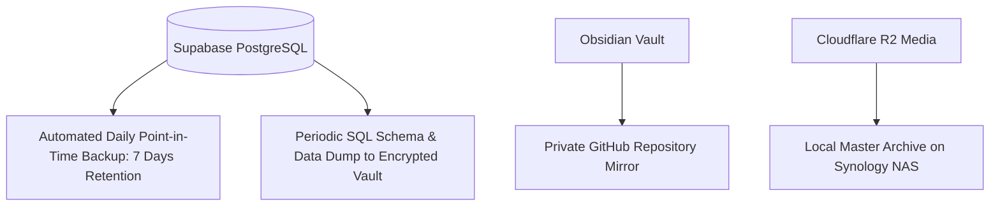

# 09.03 — Security Invariants, Privacy Policies, and Backups

Status: Current  
Last Updated: 2026-09-18  

---

## 1. Zero-Secrets Security Standard

1. **Client-Side Bundling Isolation**: No environment variable prefixed without `PUBLIC_` is ever referenced in browser-bundled code.
2. **Key Tiering**:
   - `PUBLIC_SUPABASE_ANON_KEY`: Safe for client distribution; bound strictly by Postgres RLS.
   - `SUPABASE_SERVICE_ROLE_KEY`: Restricted to serverless functions (`src/lib/supabaseServer.ts`) and background ingestion scripts.
   - `OPENROUTER_API_KEY`, `RESEND_API_KEY`, `R2_SECRET_ACCESS_KEY`: Server-only secrets.
3. **Secret Leak Detection**: Pre-commit hooks (`.githooks/`) reject any commit containing matches for high-entropy API key patterns.

---

## 2. Visitor Privacy and GDPR Compliance

- **No Third-Party Trackers**: Zero Google Analytics, Facebook Pixels, or commercial advertising tracking scripts are loaded.
- **Anonymous Sessionization**: `journey-tracker.js` records anonymized session IDs in `sessionStorage`.
- **IP Sanitization**: Raw visitor IP addresses are never written to disk or Postgres tables. Geolocation is restricted to the two-letter ISO country code supplied by Cloudflare request headers (`cf-ipcountry`).

---

## 3. Disaster Recovery and Backups

- **Postgres Backups**: Supabase manages daily automated WAL archives enabling point-in-time recovery (PITR).
- **Obsidian Vault**: Version-controlled in a private GitHub repository; changes can be rolled back per commit.
- **Media Invariants**: High-resolution photography originals in `photos/originals/` are mirrored to offline local storage.
