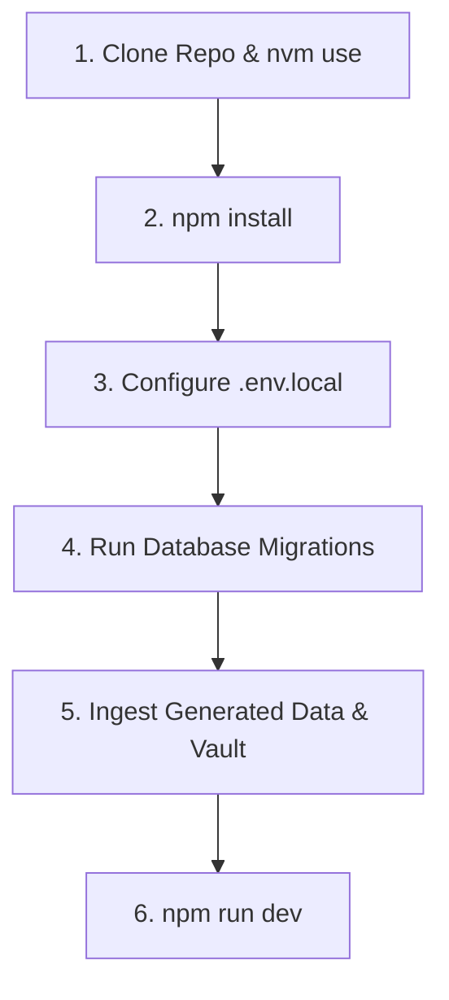

# 10.00 — Zero-to-One Developer Onboarding Runbook

Status: Current  
Last Updated: 2026-09-18  

---

## 1. Prerequisites and System Dependencies

To configure and run the `abodid.com` ecosystem from scratch on a clean machine:

- **Node.js**: Version `24.x` (managed via `.nvmrc`).
- **Package Manager**: `npm` (v10+).
- **External Accounts**: Supabase, Cloudflare (R2 + DNS), OpenRouter, Resend, Vercel.

---

## 2. Step-by-Step Installation Runbook



### 2.1. Clone and Install
```bash
# 1. Clone repository
git clone https://github.com/abodidsahoo/personal-site.git
cd personal-site

# 2. Switch to verified Node version
nvm use

# 3. Install dependencies
npm install
```

### 2.2. Configure Environment Variables
Copy `.env.example` to `.env.local` and populate keys:
```bash
cp .env.example .env.local
```

Required variable categories:
- `PUBLIC_SITE_URL`: `http://localhost:4321` (or production `https://abodid.com`).
- `PUBLIC_SUPABASE_URL` & `PUBLIC_SUPABASE_ANON_KEY`: Supabase connection.
- `SUPABASE_SERVICE_ROLE_KEY`: Serverless administration key.
- `OPENROUTER_API_KEY`: Model gateway key.
- `RESEND_API_KEY`: Transactional email key.
- `R2_ACCOUNT_ID`, `R2_ACCESS_KEY_ID`, `R2_SECRET_ACCESS_KEY`: Cloudflare storage credentials.

### 2.3. Apply Database Migrations
Using Supabase CLI:
```bash
supabase db push
# Or execute migrations in sequence via Supabase SQL Editor:
# supabase/migrations/*.sql
```

### 2.4. Generate Manifests and Ingest Data
```bash
# 1. Generate photography metadata and palettes
npm run generate:photography-portfolios

# 2. Ingest Obsidian notes and generate embeddings
npm run ingest:vault

# 3. Generate XR metadata
npm run generate:xr-previews
```

### 2.5. Launch Development Server
```bash
npm run dev
```
Open `http://localhost:4321` in your browser.
