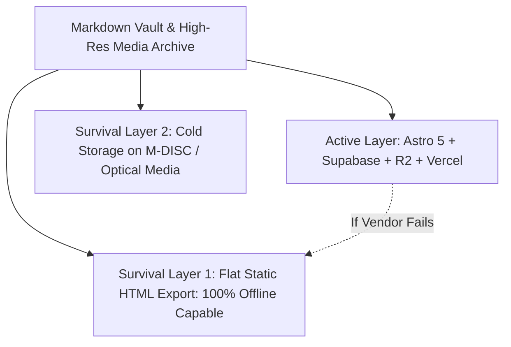

# 10.02 — Ten-to-Fifteen Year System Continuity Architecture

Status: Current  
Last Updated: 2026-09-18  

---

## 1. The Multi-Decade Preservation Strategy

Web technologies inevitably suffer obsolescence over 10–15 year horizons. To guarantee that Abodid's research, creative archive, and digital identity remain permanently accessible regardless of commercial cloud vendor lifecycles:

---

## 2. Continuity Scenarios and Survival Protocols

### 2.1. Scenario 1: Cloud Vendor Deprecation or Fee Escalation
- **If Supabase, Vercel, or Cloudflare shut down or impose unsustainable costs:**
- **Protocol**: 
  1. Export Postgres database via `pg_dump`.
  2. Run Astro in pure static export mode (`output: 'static'`, local file adapter).
  3. Deploy static bundle (`dist/`) to any commodity web server (Nginx, Apache, or IPFS).

### 2.2. Scenario 2: Frontend Framework Obsolescence
- **If Astro or React become obsolete in 2035+:**
- **Protocol**:
  1. The canonical creative content resides in standard Markdown and plain-text JSON manifests.
  2. A lightweight parser can re-render the entire site in whatever future compilation format emerges without loss of semantic structure.

### 2.3. Scenario 3: AI Model and API Deprecation
- **If hosted LLM endpoints disappear or change API formats:**
- **Protocol**:
  1. Vector search operates on open-standard pgvector math.
  2. Open-source local models (e.g., Llama / Mistral via Ollama) can be plugged directly into `/api/vault-chat` using the standard OpenAI-compatible interface.
